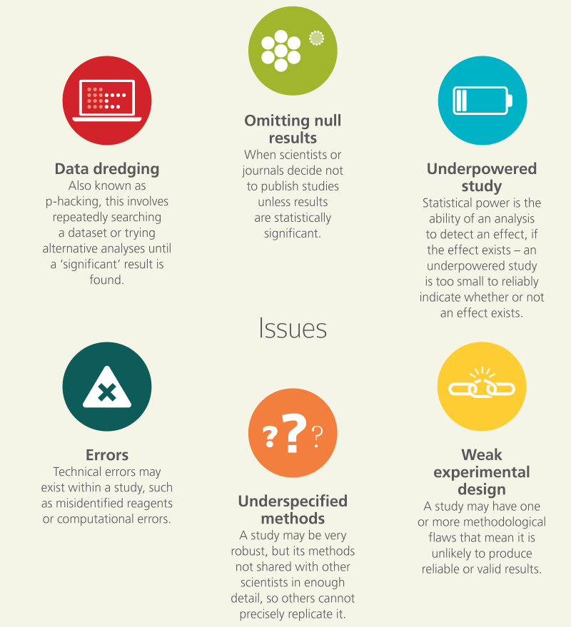

Open Science Basics

Table of Contents

[[TOC]]

## Introduction

This chapter aims to provide concrete context as well as the key points for the most relevant aspects of Open Science. Starting from the core concepts and principles of Open Science, the chapter continues to address components such as Open Research Data, Open Access, Open Peer Review and Open Science Policies, together with more practical aspects such as Reproducible Research, Open Source Software and Open Licensing and File Formats.

Each section is structured so that it includes a short description of the topic, an explanation of the relevance to Open Science, the key learning objectives that should be highlighted within the context of a training session, the major components (knowledge and skills) that should be involved, some frequent questions/obstacles/misconceptions that are encountered for that topic, and finally the expected outcomes of a training session and some further reading.

## 1. Open Concepts and Principles

### What is it?

Open Science is the practice of science in such a way that others can collaborate and contribute, where research data, lab notes and other research processes are freely available, under terms that enable reuse, redistribution and reproduction of the research and its underlying data and methods. In a nutshell, Open Science is transparent and accessible knowledge that is shared and developed through collaborative networks (Vicente-Sáez & Martínez-Fuentes 2018).

Open Science is about increased rigour, accountability, and reproducibility for research. It is based on the principles of inclusion, fairness, equity, and sharing, and ultimately seeks to change the way research is done, who is involved and how it is valued. It aims to make research more open to participation, review/refutation, improvement and (re)use for the world to benefit 

There are several definitions of "openness" with regards to various aspects of science; the Open Definition ([http://opendefinition.org/](http://opendefinition.org/)) defines it thus: “Open data and content can be freely used, modified, and shared by anyone for any purpose”. Open Science encompasses a variety of practices, usually including areas like open access to publications, open research data, open source software/tools, open workflows, citizen science, open educational resources, and alternative methods for research evaluation including open peer review ([Pontika et al., 2015](https://f1000research.com/articles/6-588/v2#ref-59)). 

Pontika et al. (2015).

The aims and assumptions underlying the push to implement these various practices have been analysed by Fecher & Friesike ([2013](https://papers.ssrn.com/sol3/papers.cfm?abstract_id=2272036)), whose analysis of the literature found five broad concerns, or "schools of thought". These are:

* **Democratic school: **Believing that there is an unequal distribution of access to knowledge, this area is concerned with making scholarly knowledge (including publications and data) available freely for all.

* **Pragmatic school: **Following the principle that the creation of knowledge is made more efficient through collaboration and strengthened through critique, this area seeks to harness network effects by connecting scholars and making scholarly methods transparent.

* **Infrastructure school: **This thread is motivated by the assumption that efficient research requires readily available platforms, tools and services for dissemination and collaboration.

* **Public school: **Based on the recognition that true societal impact requires societal engagement in research and readily understandable communication of scientific results, this area seeks to bring the public to collaborate in research through citizen science, and make scholarship more readily understandable through lay summaries, blogging and other less formal communicative methods.

* **Measurement school: **Motivated by the acknowledgement that traditional metrics for measuring scientific impact have proven problematic (by being too heavily focused on publications, often only at the journal-level, for instance), this strand seeks "alternative metrics" which can make use of the new possibilities of digitally networked tools to track and measure the impact of scholarship through formerly invisible activities.

### Rationale

Open Science, as defined above, encompasses a huge number of potential structural changes to academic practice, whose culture can often be hierarchical and conservative. Moreover, even where researchers are sympathetic to the aims of Open Science, they might not yet see the worth in taking them up, as existing incentive mechanisms do not yet reflect this new culture of openness and collaboration. As a consequence, convincing researchers of the need to change their practices will require a good understanding not only of the ethical, social and academic benefits, but also of the ways in which taking up Open Science practices will actually help them succeed in their work. This section will describe some of the core concepts, principles, actors, and practices in Open Science, and how these fit within a broader research ecosystem.

### Learning objectives

1. Understand the social, economical, legal, and ethical principles and concepts underpinning Open Science.

2. Become familiar with the history of Open Science, and the disparity and diversity of views from different research communities, disciplines and cultures.

3. Gain insight into the developments around Open Science, and the personal impact these can have on researchers, research, and society more broadly.

### Key components

#### Knowledge and Skills

* Open Science is the movement to help make the results of scholarly research more accessible, including code, data, and research papers.

    * It encompasses many different but often related aspects impacting the entire research lifecycle, including open publishing, open data, open source software, open notebook science, open peer review, open dissemination, and open materials (see glossary for definitions).

* History of Open Science, and the motivations behind the movement.

    * The origins of academic publishing began in the 17th century with the first academic journals.

    * Increasing motivation to share resources between research disciplines, as well as increased transparency for greater efficiency, rigour, accountability, sustainability for future generations, and reproducibility.

    * Ethical cases whereby increased transparency can reduce fraud, data manipulation, and selective reporting of results.

* Present state arose from pressure from research academies and governments for publicly-funded research to be shared more openly, often for the purpose of accelerated societal or economic growth and innovation.

    * Publicly funded research outputs should be publicly available.

    * Need to drive cultural change in research and amongst researchers.

    * Embracing of Web-based tools and technologies to facilitate scientific collaboration.

* Differences and commonalities within Open Science practices, principles and communities.

    * It is generally accepted that Open Science leads to increased impact associated with wider sharing and re-use (e.g., the so-called "[open access citation advantage](https://sparceurope.org/what-we-do/open-access/sparc-europe-open-access-resources/open-access-citation-advantage-service-oaca/oaca-list/)").

    * Open Science could increase trust in science and in the reliability of scientific results.

* Open Science and relations to licensing, copyright issues.

    * Typically, open research outputs are openly licensed in order to maximize re-use while allowing the creator to retain ownership and receive credit for their work.

### Questions, obstacles, and common misconceptions

Q: "What is the difference between Open Science and ‘science’?"

A: Open Science refers to doing traditional science with more transparency involved at various stages, for example by openly sharing code and data. Many researchers do this already, but don’t call it Open Science.

Q: "Does ‘Open Science’ exclude the Humanities and Social Sciences?"

A: No, the term Open Science is inclusive. Indeed, the case is that sometimes Open Science is more broadly referred to as ‘Open Research’ or ‘Open Scholarship’ to be more inclusive of other disciplines, principles and practices. However, Open Science is a commonly used term at multiple levels and so it makes sense to adopt it for communication purposes, with the proviso that it includes all research disciplines.

Q: "Does Open Science lead to misuse or misunderstanding of research?"

A: No, the application of Open Science principles is in fact a safeguard against misuse or misunderstanding. Transparency breeds trust, confidence and allows others to verify and validate the research process.

Q: "Will Open Science lead to too much information overload?"

A: It is better to have too much information and deal with it, than to have too little and live with the risk of missing the important parts. And there are technologies such as RSS feeds, machine learning and artificial intelligence that are making content aggregation easier. 

### Learning outcomes

1. Be able to explain the core underlying academic, economic, and societal principles and concepts supporting Open Science, and why this matters to you in terms of broader impacts.

2. Develop an understanding of the numerous dimensions of Open Science, and some of the tools and practices involved in this.

3. Be familiar with the present state of Open Science, and the diversity of perspectives that this encompasses.

### Further reading

* [Open Science: one term, five schools of thought](https://link.springer.com/chapter/10.1007%2F978-3-319-00026-8_2) (Fecher and Friesike, 2014).

* [When will ‘Open Science’ become simply ‘science’?](https://genomebiology.biomedcentral.com/articles/10.1186/s13059-015-0669-2) (Watson, 2015).

* [Open innovation, Open Science, open to the world - a vision for Europe](https://ec.europa.eu/digital-single-market/en/news/open-innovation-open-science-open-world-vision-europe) (2016)

* [Do you speak Open Science? Resources and tips to learn the language](https://peerj.com/preprints/2689/) (Masuzzo and Martens, 2017).

* [Open innovation, Open Science, open to the world](https://publications.europa.eu/en/publication-detail/-/publication/527ea7ce-36fc-11e7-a08e-01aa75ed71a1) : reflections of the Research, Innovation and Science Policy Experts (RISE) High Level Group (2017)

## 2. Open Research Data and Materials

### What is it?

Open research data is data that can be freely accessed, reused, remixed and redistributed, for academic research and teaching purposes and beyond. Ideally, open data have no restrictions on reuse or redistribution, and are appropriately licensed as such. In exceptional cases, e.g. to protect the identity of human subjects, special or limited restrictions of access are set. Openly sharing data exposes it to inspection, forming the basis for research verification and reproducibility, and opens up a pathway to wider collaboration. At most, open data may be subject to the requirement to attribute and sharealike (see the [Open Data Handbook](http://opendatahandbook.org/guide/en/what-is-open-data)). 

### Rationale

Research data are often the most valuable output of many research projects, they are used as primary sources that underpin scientific research and enable derivation of theoretical or applied findings. In order to make findings/studies replicable, or at least reproducible or reusable (reference to Reproducible Research and Data Analysis) in any other way, the best practice recommendation for research data is to be as open and [FAIR](https://www.force11.org/fairprinciples) as possible, while accounting for ethical, commercial and privacy constraints with sensitive data or proprietary data.

### Learning objectives

1. Gain an understanding of the basic characteristics and principles of open and FAIR research data, including appropriate packaging and documentation, to enable others to understand, reproduce, and re-use in alternative ways.

2. Familiarity with the sorts of data that might be considered sensitive, and the restrictions or constraints on openly sharing them.

3. Be able to convert a ‘closed’ dataset into one which is ‘open’ by implementing the necessary measures in a data management plan, with appropriate data stewardship and metadata.

4. Be able to use research data management plan and to make your research results findable and accessible, even if it contains sensitive data. 

5. Understand the pros and cons of openly sharing different types of data (e.g., privacy, sensitivity, de-identification, mediated access).

6. Understand the importance of appropriate metadata for sustainable archiving of research data.

7. Understand the basic workflows and tools for sharing research data.

### Key components

#### Knowledge and Skills

##### FAIR principles

In 2014, a core set of principles were drafted in order to optimize the reusability of research data, named the [FAIR Data Principles](https://www.force11.org/group/fairgroup/fairprinciples). They represent a community-developed set of guidelines and best practices to ensure that data or any digital object are **F**indable, **A**ccessible, **I**nteroperable and **R**e-usable:

**Findable: **The first thing to be in place to make data reusable is the possibility to find them. It should be easy to find the data and the metadata for both humans and computers. Automatic and reliable discovery of datasets and services depends on machine-readable persistent identifiers (PIDs) and metadata.

**Accessible: **The (meta)data should be retrievable by their identifier using a standardized and open communications protocol, possibly including authentication and authorisation. Also, metadata should be available even when the data are no longer available.

**Interoperable:** The data should be able to be combined with and used with other data or tools. The format of the data should therefore be open and interpretable for various tools, including other data records. The concept of interoperability applies both at the data and metadata level. For instance, the (meta)data should use vocabularies that follow FAIR principles.

**Re****-****usable: **Ultimately, FAIR aims at optimizing the reuse of data. To achieve this, metadata and data should be well-described so that they can be replicated and/or combined in different settings. Also, the reuse of the (meta)data should be stated with (a) clear and accessible license(s).

Distinct from peer initiatives that focus on the human scholar, the FAIR principles put a specific emphasis on enhancing the ability of machines to automatically find and use data or any digital object, in addition to supporting its reuse by individuals. The FAIR principles are guiding principles, not standards. FAIR describes qualities or behaviours that are required to make data maximally reusable (e.g., description, citation). Those qualities can be achieved by different standards.

##### Data publishing

Most researchers are more or less familiar with Open Access publishing of research articles and books (see chapter 5). More recently, and for the reasons mentioned above, data publishing has gained increasing attention. More and more funders expect the data produced in research projects they finance to be findable, accessible and as open as possible.

There are several distinct ways to make research data accessible, including ([Wikipedia](https://en.wikipedia.org/wiki/Data_publishing)):

* Publishing data as supplemental material associated with a [research article](https://en.wikipedia.org/wiki/Research_article), typically with the data files hosted by the publisher of the article.

* Hosting data on a publicly-available website, with files available for download.

* Depositing data in a repository that has been developed to support data publication, e.g., [Dataverse](https://en.wikipedia.org/wiki/Dataverse), [Dryad](https://en.wikipedia.org/wiki/Dryad_(repository)), [figshare](https://en.wikipedia.org/wiki/Figshare), [Zenodo](https://en.wikipedia.org/wiki/Zenodo). 

* A large number of general and domain or subject specific data repositories exist which can provide additional support to researchers when depositing their data. 

* Publishing a data paper about the dataset, which may be published as a preprint, in a journal, or in a data journal that is dedicated to supporting data papers. The data may be hosted by the journal or hosted separately in a data repository. Examples of data journals include [Scientific Data](https://www.nature.com/sdata/) (by SpringerNature) and the [Data Science Journal](http://www.codata.org/publications/data-science-journal) (by CODATA). For a comprehensive review of data journals, see [Candela et al.](https://doi.org/10.1002%2Fasi.23358)

The CESSDA ERIC [Expert tour guide on Data Management](https://www.cessda.eu/Research-Infrastructure/Training/Expert-tour-guide-on-Data-Management/6.-Archive-Publish/Data-publishing-routes) provides an overview of pros and cons of different data publication routes. Sometimes, your funder or another external party requires you to use a specific repository. If you are free to choose, you may consider the order of preference in the [recommendations by OpenAIRE](https://www.openaire.eu/opendatapilot-repository):

1. Use an external data archive or repository already established for your research domain to preserve the data according to recognised standards in your discipline.

2. If available, use an institutional research data repository, or your research group’s established data management facilities.

3. Use a cost-free data repository such as [Dataverse](https://en.wikipedia.org/wiki/Dataverse), [Dryad](https://datadryad.org/pages/faq#depositing-cost), [figshare](https://en.wikipedia.org/wiki/Figshare) or [Zenodo](https://en.wikipedia.org/wiki/Zenodo).

4. Search for other data repositories in [re3data](https://www.re3data.org/). There is no single filter option in re3data covering the FAIR principles, but considering the following filter options will help you to find FAIR-compatible repositories: access categories, data usage licenses, trustworthy data repositories (with a certificate or explicitly adhering to archival standards) and whether a repository gives the data a persistent identifier (PID). Another aspect to consider is whether the repository supports versioning.

You should consider where to deposit and publish your data already in your research data management plan. CESSDA offers some practical questions, which are recommended to be considered. For example: Which data and associated metadata, documentation and code will be deposited? How long does the data need to be retained? For how long should the data remain reusable? How will the data be made available? What access category will you choose? For more questions check [Adapt your DMP: part 6.](https://www.cessda.eu/Research-Infrastructure/Training/Expert-Tour-Guide-on-Data-Management/6.-Archive-Publish/Adapt-your-DMP-part-6) On the other hand don’t forget to check if a chosen repository meets requirements of your research and of your funder. Some repositories have already gained certification, like CoreTrustSeal, which certifies them to be trustworthy and to be able to meet Core Trustworthy Data Repositories Requirements. It is worth mentioning that some domain specific repositories may accept only high-quality data with a potential for reuse and that can be publicly shared.

Since there are several routes to publish your data, you should note that for a dataset to "count" as a publication, it should follow a similar publication process as an article ([Brase et al., 2009](https://doi.org/10.3233/ISU-2009-0595)) and should be:

* Properly documented with metadata;

* Reviewed for quality, e.g. content of the study, methodology, relevance, legal consistency and documentation of materials;

* Searchable and discoverable in catalogues (or databases);

* Citable in articles.

[We should have some advice on how to train policy makers to make Open Science policies; cf. e.g. [https://www.fosteropenscience.eu/sites/default/files/pdf/2276.pdf](https://www.fosteropenscience.eu/sites/default/files/pdf/2276.pdf) is on open data policies; what about policies of other aspects of Open Science? Should we have a separate section on this?]]

##### Data citation

Data citation services help research communities discover, identify, and cite research data (and often other research objects) with confidence. This typically involves the creation and allocation of Digital Object Identifiers (DOIs) and accompanying metadata through services such as DataCite ([https://www.datacite.org/](https://www.datacite.org/)), and can be integrated with research workflows and standards. This is an emerging field, and involves aspects such as conveying to journal publishers the importance of appropriate data citation in articles, as well as enabling research articles themselves to be linked to any underlying data. Through this, citable data become legitimate contributions to the process of scholarly communication, and can help pave the way for new metrics and publication models that recognize and reward data sharing.

As an initial step towards good practice for data citation, the Data Citation Synthesis Group of FORCE11 has put forward the [Joint Declaration of Data Citation Principles](https://doi.org/10.25490/a97f-egyk), targeted at both researchers and data service providers. Adhering to these principles, data repositories usually provide researchers with a reference they can use when referring to a given dataset.

##### Data packaging

Data packages are containers for describing and sharing accompanying data files, and typically comprise a metadata file describing the features and context of a dataset. This can include aspects such as creation information, provenance, size, format type, field definitions, as well as any relevant contextual files, such as data creation scripts or textual documentation. From the [Data Packaging Guide](https://github.com/saverkamp/beyond-open-data/blob/master/DataGuide.md):

* Data are forever: Datasets outlive their original purpose. Limitations of data may be obvious within their original context, such as a library catalog, but may not be evident once data is divorced from the application it was created for.

* Data cannot stand alone: Information about the context and provenance of the data--how and why it was created, what real-world objects and concepts it represents, the constraints on values--is necessary to helping consumers interpret it responsibly.

* Structuring metadata about datasets in a standard, machine-readable way encourages the promotion, shareability, and reuse of data.

##### Sharing sensitive and proprietary data

With appropriate data management planning much sensitive and proprietary data can be shared, reused, and FAIR. The metadata can almost always be shared. Guidance and best practices for sharing sensitive data are necessarily region-specific because of differing regulations (see for example UKDS’[ Companion material for Managing and Sharing Research Data handbook](https://www.ukdataservice.ac.uk/manage-data/handbook)). [International Association for Social Science Information Services and Technology](http://www.iassistdata.org/resources/data-management/best-practices) keeps a list of international guidance in data management that is a good starting point. There are several approaches and initiatives to help researchers achieve this. [DCC’s DMPonline tool](http://www.dcc.ac.uk/dmponline) includes a number of templates for funders. [The CESSDA Expert Tour Guide on Data Management](https://www.cessda.eu/Research-Infrastructure/Training/Expert-tour-guide-on-Data-Management/5.-Protect/Ethics-and-data-protection) provides information and practical examples on how to share personal data and on copyright and database issues across the European countries. The Tour Guide also gives an overview on the impact of the GDPR which will harmonize personal data legislation in Europe (May 2018), and provides an updated overview on [EU diversity on data protection](https://www.cessda.eu/Research-Infrastructure/Training/Expert-tour-guide-on-Data-Management/5.-Protect/Processing-personal-data/Diversity-in-data-protection).

###### Data brokers

Data brokers are knowledgeable, independent parties who act as data stewards for sensitive data. Researchers can transfer their sensitive data and jurisdiction over access to that data to the broker. This is especially common with patient-level data from clinical studies. Brokers provide a level of independence in the evaluation of whose data requests are scientifically valid and will not violate the privacy of research participants. Examples of data brokers include [The YODA Project](http://yoda.yale.edu/), [ClinicalStudyDataRequest.com](https://www.clinicalstudydatarequest.com/), [National Sleep Research Resource](https://sleepdata.org/) and [Supporting Open Access for Researchers (SOAR)](https://dcri.org/our-approach/data-sharing/).

##### Analysis portals

Analysis portals are platforms that allow approved analysis of data without allowing full access (viewing or downloading) or controlling where and who gets access. Some data brokers also use analysis portals. Analysis portals control what additional datasets can be pooled with the sensitive data as well as what analyses can be run to ensure that personal information is not revealed during reanalysis. Examples of virtual analysis portals include [Project Data Sphere](https://www.projectdatasphere.org/projectdatasphere/html/home), [Vivli](http://vivli.org/), [RAIRD](http://raird.no/), [Corpuscle](http://clarino.uib.no/korpuskel/page), and [INESS](http://clarino.uib.no/iness/page).

Social science and other researchers with sensitive data use a single-site analysis portal that can be accessed only under controlled regime. Approved researchers can access the data on-site, in a safe room, for scientific purposes. However, the metadata describing the data should be openly available and adhering to the FAIR principles.

##### De-identified and synthetic data

Many datasets containing participant-level private information can be shared once the dataset has been de-identified (Safe Harbor method) or a expert has determined that the dataset is not individually identifiable (Expert Determination method). Consult with your Research Ethics Board / Institutional Review Board to learn how to do this with your data. We also recommend [the CESSDA Expert Tour Guide on Data Management](https://www.cessda.eu/Research-Infrastructure/Training/Expert-tour-guide-on-Data-Management/5.-Protect/Ethics-and-data-protection), which provides information and practical examples on how to share personal data. However, some datasets cannot be safely de-identified and shared. Researchers can still improve the openness of research on such data by creating and sharing synthetic data. Synthetic data is similar in structure, content, and distribution to the real data and aims to attain "analytic validity": statistical analysis will return the same results for the synthetic data as the real data. The United States Census Bureau, for example, uses [synthetic data and analysis portals](https://census.gov/content/dam/Census/programs-surveys/sipp/methodology/SSBdescribe_nontechnical.pdf) in combination to allow reuse of highly sensitive data. 

###### DataTags

[DataTags](https://datatags.org/) is a framework designed to enable computer-assisted assessments of the legal, contractual, and policy restrictions that govern data sharing decisions. The DataTags system asks a user a series of questions to elicit the key properties of a given dataset and applies inference rules to determine which laws, contracts, and best practices are applicable. The output is a set of recommended DataTags, or simple, iconic labels that represent a human-readable and machine-actionable data policy, and a license agreement that is tailored to the individual dataset. The DataTags system is being designed to integrate with data repository software, and it will also operate as a standalone tool. DataTags is being developed at Harvard University. In Europe, DANS is working on adjusting DataTags to European legislation / General Data Protection Regulation ([GDPR](https://www.eugdpr.org/)) (cf. [DANS GDPR DataTags](https://zingtree.com/host.php?style=buttons&tree_id=442670046&persist_names=Restart&persist_node_ids=58#58)).

As mentioned above, the ultimate goal of data sharing your research data is to make them maximally reusable. To that end, before sharing your data you should manage them according to best practice. This includes, i.a., documentation and the choice of open file formats and licenses. You can read more about these issues in [Section 4: Reproducible Research and Data Analysis](#heading=h.jy7n9xm9zn9o) as well as [Section 6: Open Licensing and File Formats](#heading=h.3rdryh4tn529).

Other things to include still:

* RDM, including

    * Metadata/documentation

* Funder requirements?

##### Open Materials

In addition to data sharing, the openness of research relies on sharing of materials. What materials researchers use is discipline-specific and sometimes unique to a lab. Below are examples of materials you can share, although always confer with peers in your discipline to identify which repositories are used. When you have materials, data, and publications from the same research project shared in different repositories, cross-reference them with a link and a unique identifier so they can be easily located.

###### Reagents

A reagents is a substance, compound or mixture that can be added to a system in order to create a chemical or other reaction. Reagents can be deposited with repositories like [Addgene](https://www.addgene.org/), [The Bloomington Drosophila Stock Center](https://bdsc.indiana.edu/), and [ATCC](https://www.atcc.org/) to make them easily accessible to other researchers. License your materials so they can be reused by other researchers. 

###### Protocols

A protocol describes a formal or official record of scientific experimental observations in a structured format. Deposit virtual protocols for citation, adaptation, and reuse using [Protocols.](https://www.protocols.io/)[io](https://www.protocols.io/).

###### Notebooks, containers, software, and hardware

Reproducible analysis is aided by the use of literate programming, container technology, and virtualization. In addition to sharing your code and data, also share your Jupyter notebooks, Docker images, or other analysis materials or software dependencies. Share notebooks with Open services such as [mybinder](http://mybinder.org) that allow for public viewing and execution of the entire notebook on shared resources. Containers and notebooks can be shared with [Rocker](https://arxiv.org/abs/1710.03675) or [Code Ocean](https://codeocean.com/). Software and hardware used in your research should be shared following best practices for documentation as outlined in [Section 3](#heading=h.6wyt4uyc37a). Read-only protocols should be deposited in your disciplines registry such as [ClinicalTrials.gov](https://clinicaltrials.gov/) and [SocialScienceRegistry](https://www.socialscienceregistry.org/) or a general registry like [Open Science](https://osf.io/)[ Framework](https://osf.io/). Many journals, such as [Trials](https://trialsjournal.biomedcentral.com/), [JMIR Research Protocols](https://www.researchprotocols.org/), or [Bio-Protocol](https://bio-protocol.org/), will publish your protocol. Best practices for publishing your protocol open access are the same as publishing your report open access (see [Section 5](#heading=h.go419g8z6pnt)). 

### Questions, obstacles, and common misconceptions

Q: "Is it sufficient to make my data openly available?"

A: "No—openness is a necessary but not sufficient condition for maximum reuse. Data have to be FAIR in addition to open."

Q: "What do the FAIR principles mean/imply for different stakeholders/audiences?"

A: "This is a great topic for discussion!"

Obstacle: Researchers may be reluctant to share their data because they are afraid that others will reuse them before they have extracted the maximum usage from them, or that others might not fully understand the data and therefore mis-use them.

(suggested) A: You may publish your data to make them findable with metadata, but set an embargo period on the data to make sure that you can publish your own article(s) first. 

Q: "Is making my data FAIR a lot of extra work?"

A: "Not necessarily! Making data FAIR is not only the responsibility of the individual researchers but of the whole group. The best way to ensure that your data is FAIR is to create a Data Management Plan and plan everything beforehand. During the data collection and data processing follow the discipline standards and measures recommended by a repository. 

Q: "I want to share my data. How should I license them?"

A: "That’s a good question. First of all think about who owns the data? A research funder or an institution that you work for. Then, think about authorship. Applying a suitable license to your data is crucial in order to make them reusable. For more information about licensing, please see “6. Open Licensing and Formats".”

Q: "I cannot make my data directly available—they are too large to share conveniently / have restrictions related to privacy issues. What should I do?"

A: "You should talk to experts in domain specific repositories on how to provide sufficient instructions to make your data findable and accessible."

### Learning outcomes

1. Understand the characteristics of open data, and in particular the FAIR principles.

2. Be familiar with some of the arguments for and against open data.

3. Be able to differentiate and address sensitive data and open/FAIR data; these two categories are not necessarily incompatible.

4. Be able to transform a dataset into one that is sufficient for open sharing (non-proprietary format), meets the standards of the FAIR principles, and is designed for maximized accessibility, transparency and re-use by providing sufficient metadata.

5. Know the difference between raw and processed (or cleaned) data, and the importance of version labels.

6. Know commonly used file formats and community standards for maximum re-usability.

7. Be able to write a data management plan.

### Further reading

* The FAIR Guiding Principles for scientific data management and stewardship: [https://www.nature.com/articles/sdata201618](https://www.nature.com/articles/sdata201618)

* Guiding principles for Findable, Accessible, Interoperable, and Re-usable data publishing Version B1.0: [https://www.force11.org/fairprinciples](https://www.force11.org/fairprinciples)

* The FAIR Data Principles explained
[https://www.dtls.nl/fair-data/fair-principles-explained/](https://www.dtls.nl/fair-data/fair-principles-explained/)

* GO FAIR Initiative: [https://www.go-fair.org/](https://www.go-fair.org/)

* FAIR Metrics: [http://fairmetrics.org/](http://fairmetrics.org/)

* Cloudy, increasingly FAIR; revisiting the FAIR Data guiding principles for the European Open Science Cloud: [https://doi.org/10.3233/ISU-170824](https://doi.org/10.3233/ISU-170824)

* [Making data sharing count: a publication-based solution](https://www.frontiersin.org/articles/10.3389/fnins.2013.00009/full) (Gorgolewski et al., 2013).

* [Data reuse and the open data citation advantage](https://peerj.com/articles/175/) (Piwowar and Vision, 2013).

* Expert tour guide on data management [https://www.cessda.eu/Research-Infrastructure/Training/Expert-tour-guide-on-Data-Management](https://www.cessda.eu/Research-Infrastructure/Training/Expert-tour-guide-on-Data-Management)

* [Making Data Count](https://www.nature.com/articles/sdata201539) (Kratz and Strasser, 2015).

* [Data packaging guide](https://github.com/saverkamp/beyond-open-data/blob/master/DataGuide.md).

* CESSDA ERIC, ["Citing your data"](https://www.cessda.eu/Research-Infrastructure/Training/Expert-tour-guide-on-Data-Management/6.-Archive-Publish/Publishing-with-CESSDA-archives/Citing-your-data)

* 5 ★ OPEN DATA, [http://5stardata.info/en/](http://5stardata.info/en/) 

## 3. Open Research Software and Open Source

### What is it?

Open research software, or open-source research software, refers to the use and development of software for analysis, simulation, visualization, etc. where the full source code is available. In addition, according to the [Open Source Definition](https://opensource.org/osd), open-source software must be distributed in source and/or compiled form (with the source code available in the latter case), and must be shared under a license that allows modification, derivation, and redistribution.

### Rationale

Modern research relies on software, and building upon—or reproducing—that research requires access to the full source code behind that software (Barnes, 2010; Morin et al., 2012; Ince et al., 2012; Prins et al. 2015; Lowndes et al., 2018). As Buckheit and Donoho put it, paraphrasing Jon Claerbout, ‘‘An article about a computational result is advertising, not scholarship. The actual scholarship is the full software environment, code and data, that produced the result’’ (Buckheit & Donoho, 1995). Open access to the source code of research software also helps improve the impact of the research (Vandewalle, 2012).

Sharing software used for research (whether computational in nature, or that relies on any software-based analysis/interpretation) is a necessary, though not sufficient, condition for reproducibility. This is due to the unavoidable ambiguity that arises when trying to fully describe software using natural language, e.g., in a paper (Ince et al., 2012). Furthermore, many (if not most) software programs may contain some undetected errors (Soergel, 2015), so even a "perfect" written description of software would not be able to account for all results.

In addition to reproducibility, sharing software openly allows developers to receive career credit for their efforts, either through direct citation (Smith et al., 2016) or via software meta-articles published in, e.g., the *[Journal of Open Research Softwar*e](http://openresearchsoftware.metajnl.com) or the *[Journal of Open Source Softwar*e](http://joss.theoj.org) (Smith et al., 2018). Neil Chue Hong maintains a [list of many domain-specific journals](https://www.software.ac.uk/which-journals-should-i-publish-my-software) that publish software articles.

### Learning objectives

1. Learn the characteristics of open software; understand the ethical, legal, economic, and research-impact arguments for and against open software, and further understand the quality requirements of open code.

2. Learn how to use existing open software and appropriately attribute (cite) it.

3. Learn how to use common tools and services for sharing research codes openly.

4. Be able to choose the appropriate license for their software, and understand the difference between permissive and non-permissive licenses.

### Key components

#### Knowledge

There are several different platforms that support open sharing and collaboration on software, research or otherwise. First of all, you can use this checklist to evaluate openness of existing research software:

* Is the software available to download and install?

* Can the software easily be installed on different platforms?

* Does the software have conditions on the use?

* Is the source code available for inspection?

* Is the full history of the source code available for inspection through a publicly available version history?

* Are the dependencies of the software (hardware and software) described properly? Do these dependencies require only a reasonably minimal amount of effort to obtain and use?

These qualities relate to and build on the [Open Source Definition](https://opensource.org/osd).

GitHub is a popular tool that allows version control: management and overall tracking of changes in a particular piece of software. Services such as GitHub, GitLab, Bitbucket, and others provide an interface to the tool as well as remote storage services that can be used to maintain, share, and collaborate on research software. As a tool it is quite widespread and, although it has an initial learning curve, it has proven invaluable to establishing an open and reproducible research workflow.

Having the research software on GitHub is just the first part; it is equally important to have a published and persistent identifier associated with it, such as a DOI. There are several ways of associating a DOI with a GitHub repository; the easiest one is to employ Zenodo (a free, open catch-all repository created by OpenAIRE and CERN) to do the assignment, although other repositories for archiving software and obtaining a DOI do exist, such as Figshare. [Zenodo integrates with GitHub](https://guides.github.com/activities/citable-code/) to archive the software and provide a DOI when developers make a formal release on GitHub.

Publicly shared software is not actually open source unless accompanied by a suitable license, because by default software (along with any other creative work) falls under exclusive copyright to the creators, meaning no one else can use, copy, distribute, or modify your work ([https://choosealicense.com/no-permission/](https://choosealicense.com/no-permission/)). (If you truly want to share your code with no restrictions whatsoever, you can [dedicate it to the public domain](https://choosealicense.com/licenses/#unlicense).) Instead, you should choose an appropriate license for your software, based on what you would prefer to let others do (or prevent them from doing) with your code; the [choosealicense.org](https://choosealicense.com) site is a helpful resource to differentiate between licenses, although it does not feature [every available or popular open-source license](https://opensource.org/licenses). Once you select a license, put the text—edited to include the author name(s) and year—in the software repository as a plaintext LICENSE file.

Although sharing software in any form is better than not sharing it, your software will have more impact and be more easily used by others—and your future self!—if you include documentation. This can include helpful comments in the code that explain **why** you did something (rather than what you did, which should be evident), an informative README file that describes what your software does and gives some helpful information (e.g., how to install, how to cite, how to run, important dependencies), tutorials/examples, and/or API documentation (which may be automatically generated from properly formatted comments in the code).

Missing or inaccessible dependencies or insufficient documentation of the computational environment are very common barriers to reuse and reproducibility. One approach to address these barriers is to share your code with your computational environment using container technology. Containers package the code with the dependencies and computational environment so others can more easily run your analysis. Examples of container implementation in research include [Rocker](https://arxiv.org/abs/1710.03675), [Binder](https://mybinder.readthedocs.io/en/latest/), and [Code Ocean](https://codeocean.com/).

When you use software—whether you wrote it, or someone else did and made it available—appropriate citation is important for reproducibility (discussed more in [Section 4](#heading=h.jy7n9xm9zn9o); briefly, the version used can change your results or interpretation) and giving credit to the developers of the software (Niemeyer 2016, Smith 2016). The decision of when to cite software is up to you as the researcher, but we recommend a citation whenever the software did some work integral to your results, interpretation, or conclusions. The best way to make *your* code easily citable is to use the GitHub–Zenodo integration described before and provide the resulting DOI in an obvious place like the software’s README, perhaps along with a suggested citation format. When citing any software, you should include at minimum the author name(s), software title, version number, and unique identifier/locator (Smith 2016). If you use someone else’s software and they provided a DOI, then you can easily use that to identify and point to the software; if they did not archive their software, then you should include a URL where the software can be found and the version number or (e.g.) commit hash.

Additional, more complicated concepts include automated testing and continuous integration of software, packaging of software in binary formats, and governance and management of multi-person open-source projects (i.e., codes of conduct, contributing guides). Some of these topics are described by Scopatz and Huff (2015). Wilson et al. (2017) also provide a practical guide to best practices for scientific computing that includes advice specifically on research software development.

##### Open Source Hardware

The open source principles above extend to hardware. Researchers often use proprietary instrumentation or hardware in their research that is not freely accessible, reusable, or adaptable. Scientific hardware includes everything from sequencing tools and microscopes to specialized testing equipment and particle colliders. Open Science Hardware (OScH) community, for example, is leading a push for the open source movement to include scientific tools, hardware, and research infrastructures through their [Global Open Science Hardware Roadmap](http://openhardware.science/global-open-science-hardware-roadmap/).

#### Skills

* Create a repository on GitHub, and enable the integration with Zenodo. Mint the first release of the software.

* Choose a software license using (e.g.) [https://choosealicense.com](https://choosealicense.com) or the [Open Source Initiative](https://opensource.org/licenses).

* Create documentation for a software package, including README, comments, and examples.

* Appropriately cite software used for a paper.

### Questions, obstacles, and common misconceptions

Q: "I can’t share my software—it’s too messy / it doesn’t have good documentation / I didn’t leave good comments!"

A: Developers of research software around the world empathize with this feeling—people rarely feel like their code is "ready" to publicly share or that it is “finished”. However, as Barnes (2010) put it, “if your code is good enough to do the job, then it is good enough to release—and releasing it will help your research and your field.” In other words, if you feel comfortable enough with your software to publish a study or report results, then the code is sufficiently developed to share with your colleagues. (In the other direction, if you don’t feel comfortable sharing the code, then perhaps it requires more development or testing before using in a publication). Plus, sharing your code allows others to improve and build upon it, leading to even greater impact and innovation (and citations for you!).

Q: "What if someone takes the code I have shared and uses it for nefarious purposes, or claims they wrote it?"

A: Selecting an appropriate license for your software will help protect you from any uses of your software by others; for example, the common [MIT License](https://choosealicense.com/licenses/mit/) includes both limitations of liability and states that no warranty is provided. If someone else tries to claim that they wrote the software you made available, then you can point to the timestamps on your repository or archived versions as proof of your prior work.

Q: "If I share my code in an online repository, I will be deluged with requests for user support."

A: Although potential users may ask you for help, either via email or (e.g.) issues filed on the online repository, you are under no obligation to provide support if you prefer not to or cannot do so. An appropriate license even provides you with legal protection for this (e.g., the no-warranty clause of the [MIT License](https://choosealicense.com/licenses/mit/)).

Common misconception: simply putting code online makes it open-source software. In fact, unless the software is accompanied by a license that grants permission for others to use, copy, modify, and/or distribute, then the developer(s) retain exclusive copyright. A open-source license needs to accompany the code to make it open-source software.

### Learning outcomes

1. Be able to share software under the most appropriate license (i.e., both the tools and the licensing).

2. Be able to upload, version, and register a piece of code under a persistent identifier.

3. Be able to cite software used for a research article.

### Further reading

* [The Future of Research in Free/Open Source Software Development](http://www.ics.uci.edu/~wscacchi/Papers/New/FoSER-Scacchi-2010.pdf) (Scacchi, 2010).

* [The Scientific Method in Practice: Reproducibility in the Computational Sciences](http://datascienceassn.org/sites/default/files/The%20Scientific%20Method%20in%20Practice%20-%20Reproducibility%20in%20the%20Computational%20Sciences.pdf) (Stodden, 2010).

* [The case for open computer programs](https://www.nature.com/articles/nature10836) (Ince et al., 2012).

* [Shining Light into Black Boxes](https://www.ncbi.nlm.nih.gov/pmc/articles/PMC4203337/pdf/nihms588981.pdf) (Morin et al., 2012).

* [Code Sharing Is Associated with Research Impact in Image Processing](https://infoscience.epfl.ch/record/206184/files/Vandewalle12.pdf) (Vandewalle, 2012).

* [Current issues and research trends on open-source software communities](https://idus.us.es/xmlui/bitstream/handle/11441/32245/Current%20issues%20and%20research%20trends.pdf?sequence=1) (Martinez-Torres and Diaz-Fernandez, 2013).

* [Ten simple rules for reproducible computational research](http://journals.plos.org/ploscompbiol/article?id=10.1371/journal.pcbi.1003285) (Sandve et al., 2013).

* [Practices in source code sharing in astrophysics](https://arxiv.org/abs/1304.6780) (Shamir et al., 2013).

* [A systematic literature review on the barriers faced by newcomers to open source software projects](http://igor.pro.br/publica/papers/IST_SysReview_PrePrint.pdf) (Steinmacher et al., 2014).

* [Knowledge sharing in open source software communities: motivations and management](https://pdfs.semanticscholar.org/f2a2/c5129cf5656af7acc7ffaf84c9c9bafe72c5.pdf) (Iskoujina and Roberts, 2015).

* [An open source pharma roadmap](http://journals.plos.org/plosmedicine/article?id=10.1371/journal.pmed.1002276) (Balasegaram et al., 2017).

* [Upon the Shoulders of Giants: Open-Source Hardware and Software in Analytical Chemistry](https://pubs.acs.org/doi/abs/10.1021/acs.analchem.7b00485) (Dryden et al., 2017).

* [Four simple recommendations to encourage best practices in research software](https://f1000research.com/articles/6-876/v1) (Jiménez et al., 2017).

* [Perspectives on Reproducibility and Sustainability of Open-Source Scientific Software from Seven Years of the Dedalus Project](https://arxiv.org/abs/1801.08200) (Oishi et al., 2018).

## 
4. Reproducible Research and Data Analysis

### What is it?

Reproducibility means that research data and code are made available so that others are able to reach the same results as are claimed in scientific outputs. Closely related is the concept of replicability, the act of repeating a scientific methodology to reach similar conclusions. These concepts are core elements of empirical research. 

Improving reproducibility leads to increased rigour and quality of scientific outputs, and thus to greater trust in science. There has been a growing need and willingness to expose research workflows from initiation of a project and data collection right through to the interpretation and reporting of results. These developments have come with their own sets of challenges, including designing integrated research workflows that can be adopted by collaborators while maintaining high standards of integrity.

The concept of reproducibility is directly applied to the scientific method, the cornerstone of Science, and particularly to the following five steps:

1. Formulating a hypothesis

2. Designing the study

3. Running the study and collecting the data

4. Analyzing the data

5. Reporting the study

Each of these steps should be clearly reported by providing clear and open documentation, and thus making the study transparent and reproducible.

### Rationale

Overarching factors can further contribute to the causes of non-reproducibility, but can also drive the implementation of specific measures to address these causes. The culture and environment in which research takes place is an important ‘top-down’ overarching factor. From a ‘bottom-up’ perspective, continuing education and training for researchers can raise awareness and disseminate good practice.

While understanding the full range of factors that contribute to reproducibility is important, it can also be hard to break down these factors into steps that can immediately be adopted into an existing research program and immediately improve its reproducibility. One of the first steps to take is to assess the current state of affairs, and to track improvement as steps are taken to increase reproducibility even more. Some of the common issues with research reproducibility are shown in the figure below.

Source: [Reproducibility and reliability of biomedical research: improving research practice](https://acmedsci.ac.uk/viewFile/56314e40aac61.pdf).

Goodman, Fanelli, & Ioannidis (2016) ([http://stm.sciencemag.org/content/8/341/341ps12](http://stm.sciencemag.org/content/8/341/341ps12)) note that in epidemiology, computational biology, economics, and clinical trials, reproducibility is often defined as:

*the ability of a researcher to duplicate the results of a prior study using the same materials as were used by the original investigator. That is, a second researcher might use the same raw data to build the same analysis files and implement the same statistical analysis in an attempt to yield the same results.*

This is distinct from replicability:

*which refers to the ability of a researcher to duplicate the results of a prior study if the same procedures are followed but new data are collected.*

A simpler way of thinking about this might be that reproducibility is methods-oriented, whereas replicability is results-oriented.

Reproducibility can be assessed at several different levels: at the level of an individual project (e.g., a paper, an experiment, a method or a dataset), an individual researcher, a lab or research group, an institution, or even a research field. Slightly different kinds of criteria and points of assessment might apply to these different levels. For example, an institution upholds reproducibility practices if it institutes policies that reward researchers who conduct reproducible research. On the other hand, a research field might be considered to have a higher level of reproducibility if it develops community-maintained resources that promote and enable reproducible research practices, such as data repositories, or common data-sharing standards.

### Learning objectives

There are three major objectives that need to be addressed here:

1. Understand the important impact of creating reproducible research.

2. Understand the overall setup of reproducible research (including workflow design, data management and dynamic reporting).

3. Be aware of the individual steps in the reproducibility process, as well as the corresponding resources that can be employed.

### Key components

#### Knowledge

The following is an indicative list of take-away points on reproducibility:

* What is the ‘reproducibility crisis’, and meta-analyses of reproducibility.

* Principles of reproducibility, and integrity and ethics in research.

* What are the computing options and environments that allow collaborative and reproducible set up.

* Factors that affect reproducibility of research.

* Data analysis documentation and open research workflows.

* Reproducible analysis environments (virtualization).

* Addressing the "Researcher Degrees of Freedom" (Wicherts et al., 2016):

#### Skills

There are several practical tips for reproducibility that one should have in mind when setting out the particular skills necessary to ensure this. Best practices in reproducibility borrow from Open Science practices more generally but their integration offers benefits to the individual researcher themselves, whether they choose to share their research or not. The reason that integrating reproducibility best practices benefits the individual researcher is that they improve the planning, organization, and documentation of research. Below we outline one example of implementing reproducibility into a research workflow with references to these practices in the handbook.

##### **1. Plan for reproducibility before you start **

###### Create a study plan or protocol.

Begin documentation at study inception by writing a study plan or protocol that includes your proposed study design and methods. Use a reporting guideline from the [Equator Network](http://www.equator-network.org/) if applicable. Track changes to your study plan or protocol using version control (reference to Version Control). Calculate the power or sample size needed and report this calculation in your protocol as underpowered studies are prone to irreproducibility.

###### Choose reproducible tools and materials

Select antibodies that work using an antibody search engine like [CiteAb](https://www.citeab.com/). Avoid irreproducibility through misidentified cell lines by choosing ones that are authenticated by the [International Cell Line Authentication Committee](http://iclac.org/). Whenever possible, choose software and hardware tools where you retain ownership of your research and can migrate your research out of the platform for reuse (see Open Research Software and Open Source).

###### Set-up a reproducible project

Centralize and organize your project management using an online platform, a central repository, or folder for all research files. You could use GitHub as a place to store project files together or manage everything using a electronic lab notebook such as [Benchling](https://benchling.com/), [Labguru](https://www.labguru.com/),or [SciNote](https://scinote.net/). Within your centralized project, follow best practices by separating your data from your code into different folders. Make your raw data read-only and keep separate from processed data (reference to Data Management). 

When saving and backing up your research files, choose formats and informative file names that allow for reuse. File names should be both machine and human readable (reference to Data Management). In your analysis and software code, use relative paths. Avoid proprietary file formats and use open file formats (see 6 Open Licensing and File Formats). 

##### **2. Keep track of things**

###### Registration

Preregister important study design and analysis information to increase transparency and counter publication bias of negative results. Free tools to help you make your first registration include [AsPredicted](https://aspredicted.org/), [Open Science Framework](https://osf.io/), and [Registered Reports](https://cos.io/rr/). Clinical trials should use [Clinicaltrials.gov](https://clinicaltrials.gov/).

###### Version control

Track changes to your files, especially your analysis code, using version control (see Open Research Software and Open Source).

###### Documentation

Document everything done by hand in a README file. Create a data dictionary (also known as a codebook) to describe important information about your data. For an easy introduction, use: [Karl Broman’s Data Organization module](http://kbroman.org/dataorg/pages/dictionary.html) and refer to Data Management.

###### Literate programming

Consider using [Jupyter Notebooks](http://jupyter.org/), [KnitR](https://yihui.name/knitr/), [Sweave](https://support.rstudio.com/hc/en-us/articles/200552056-Using-Sweave-and-knitr), or other approaches to literate programming to integrate your code with your narrative and documentation. 

##### **4. Share and license your research**

###### Data

Avoid supplementary files, decide on an acceptable permissive license, and share your data using a repository. Follow best practices as outlined in the Open Research Data and Materials chapter.

###### Materials 

Share your materials so they can be reused. Deposit reagents with repositories like [Addgene](https://www.addgene.org/), [The Bloomington Drosophila Stock Center](https://bdsc.indiana.edu/), and [ATCC](https://www.atcc.org/) to make them easily accessible to other researchers. For more information, see the Open Materials subsection of Open Research Data and Materials.

###### Software, notebooks, and containers

Licence your code to inform about how it may be (re)used. Share notebooks with services such as [mybinder](http://mybinder.org) that allow for public viewing and execution of the entire notebook on shared resources. Share containers or notebooks with services such as [Rocker](https://arxiv.org/abs/1710.03675) or [Code Ocean](https://codeocean.com/). Follow best practices outlined in Open Research Software and Open Source.

##### **5. Report your research transparently**

Report and publish your methods and interventions explicitly and transparently and fully to allow for replication. Guidelines from the [Equator Network](http://www.equator-network.org/), tools like [Protocols.io](https://www.protocols.io/), or processes like [Registered Reports](https://cos.io/rr/) can help you report reproducibly. Remember to post your results to your public registration platform (such as [ClinicalTrials.gov](https://www.socialscienceregistry.org/) or the [SocialScienceRegistry](https://www.socialscienceregistry.org/)) within a year of finishing your study no matter the nature or direction of your results.

### Questions, obstacles, and common misconceptions

* "Everything is in the paper; anyone can reproduce this from there!"

    * This is one of the most common misconceptions. Even having an extremely detailed description of the methods and workflows employed to reach the final result will not be sufficient in most cases to reproduce it. This can be due to several aspects, including different computational environments, differences in the software versions, implicit biases that were not clearly stated, etc.

* "I don’t have the time to learn and establish a reproducible workflow."

    * In addition to a significant number of freely available online services that can be combined and facilitate the setting up of an entire workflow, spending the time and effort to put this together will increase both the scientific validity of the final results as well as minimize the time of re-running or extending it in further studies.

* "Terminologies describing reproducibility are challenging; see Barba (2018)."

### Learning outcomes

1. Be able to establish a reproducible workflow within the context of an example task.

### Further reading

* Calculate your power: [Button et al. (2013) study of the relationship between reproducibility and power.](https://www.nature.com/articles/nrn3475)

* Informative naming: [Karl Broman’s Data Organization module: Choose good names for things](http://kbroman.org/dataorg/pages/names.html)

## 5. Open Access to Published Research Results

### What is it?

Open Access to publications means that research publications like articles and books can be accessed online, free of charge by any user, with no technical obstacles (such as mandatory registration or login to specific platforms). At the very least, such publications can be read online, downloaded and printed. Ideally, additional rights such as the right to copy, distribute, search, link, crawl and mine should also be provided. Open Access can be realised through two main non-exclusive routes:

* Green Open Access (self-archiving): The published work or the final peer-reviewed manuscript that has been accepted for publication is made freely and openly accessible by the author, or a representative, in an online repository. Some publishers request that Open Access be granted only after an embargo period has elapsed. This embargo period can last anywhere between several months and several years. For publications that have been deposited in a repository but are under embargo, usually at least the metadata are openly accessible.

* Gold Open Access (Open Access publishing): The published work is made available in Open Access mode by the publisher immediately upon publication. The most common business model is based on one-off payments by authors (commonly called APCs – article processing charges – or BPCs – book processing charges). Where Open Access content is combined with content that requires a subscription or purchase, in particular in the context of journals, conference proceedings and edited volumes, this is called hybrid Open Access.

### Rationale

One of the most common ways to disseminate research results is by writing a manuscript and publishing it in a journal, conference proceedings or book. For many years those publications were available to the public under a payment by means of a subscription fee or individually. However, at the turn of the 21st century a new movement appeared with a clear objective: make all the research results available to the public without any restriction. This movement took the name of Open Access and established two initial strategies to achieve its final goal. The first strategy was to provide tools and assistance to scholars to deposit their refereed journal articles in open electronic repositories. The second one was to launch a new generation of journals using copyright and other tools to ensure permanent open access to all the articles they publish. As a result of the first strategy we see self-archiving practices: researchers depositing and disseminating papers in institutional or subject based repositories. And as a result of the second strategy we have seen the creation of the open access journals that provide free access to readers and allow reuse of their contents without almost any restriction.

Beyond those two strategies established in the Budapest Open Access Initiative in 2002 ([http://www.budapestopenaccessinitiative.org/read](http://www.budapestopenaccessinitiative.org/read) ), we have seen the growth of new methods of dissemination. Among them, we find the publication of preprints through institutional repositories and preprint servers. Preprints are widely used in physical sciences and now emerging in life sciences and other fields. Preprints are documents that have not been peer reviewed but are considered as a complete scientific publication in a first stage. Some of the preprints servers include open peer review services and the availability to post new versions of the initial paper once reviewed by peers. Following this trend of including open peer review processes in preprint servers we have seen the development of new publishing platforms supported by funders like the Wellcome Trust ([https://wellcomeopenresearch.org/](https://wellcomeopenresearch.org/)) or the Bill and Melinda Gates Foundation ([https://gatesopenresearch.org/](https://gatesopenresearch.org/)) . Even the European Commission is planning to to launch a [publishing platform for the Horizon 2020 funded projects](https://ec.europa.eu/research/openscience/pdf/information_note_platform_public.pdf). 

The choice of a journal or a publishing platform may affect the availability and accessibility of the research results. There are several options for researchers when deciding where, when, and how to publish their findings. It is fundamental to know all the implications to avoid future problems.

The rise of many business models around open access journals poses a lot of misunderstandings and uncertainties to the researchers when deciding where to publish. Moreover, paywalled journals offer individual open access models, the so-called hybrid model, that brings more complexity when deciding where and how to publish.

Regarding self archiving, researchers are confused by the different requirements established by the publishers in relation with version of a paper that they can deposit in a repository and when this version can be available to the public. This delay in allowing public access to the full text is often called embargo period and it is not uniform for all the journals. Institutions who provide a repository for its researchers should facilitate self archiving practices by digesting all those publisher requirements. 

### Learning objectives

1. Learn about the different options a researcher has when deciding where to publish a paper, including funder requirements.

2. Be able to decide if a paper can be published before peer review, for example in a preprint server. Trainees will learn how to determine which options they have according to their disciplines/journal policies, and if there would be consequences afterwards that might jeopardize final publication in a peer-reviewed journal.

3. Trainees will learn how to discover the differences between policies of peer-reviewed journals, particularly when submitting something available as a preprint. They will learn the differences among open-access journals, such as which require a fee for submission/publication and which licenses they use.

4. Trainees will learn about the implications of publishing in paywalled journals for future self-archiving in a repository, and the publisher requirements in terms of version and embargo. Trainees will also learn about hybrid open-access journals.

5. (optional depending on audience) Trainees will learn about open-access opportunities when publishing in books, since this is the main avenue of dissemination for some disciplines.

6. Trainees will learn about different business models used by open-access journals, and opportunities for obtaining funds to support publishing if needed.

### Key components

#### Knowledge

**Repositories and self-archiving**

At the beginning of 2018 more than 4600 repositories are available for researchers to self-archive their publications according to the [Registry of Open Access Repositories](http://roar.eprints.org/). In this list we can find institutional repositories, subject based or thematic repositories and harvesters. The first ones are generally managed by research performing institutions to provide to their community a place to archive and share openly papers and other research outputs. Subject based repositories are usually managed by research communities and most of the contents are related to a certain discipline. Finally, harvesters aggregate content from different repositories becoming sites to perform general searches and build other value-added services. It is fundamental for a repository to be harvested to acquire more visibility. For that purpose, repository managers need to follow standard guidelines regarding the use of metadata and the values of these metadata. Moreover, institutional repositories can be linked with other information databases to increase discoverability, for example PubMed offers the possibility to link its registers by the linkout project ([https://www.ncbi.nlm.nih.gov/projects/linkout/doc/IR-application.shtml](https://www.ncbi.nlm.nih.gov/projects/linkout/doc/IR-application.shtml)). Repositories have always been seen as an alternative way to access to scientific publications when accessing to the original source is not affordable. Currently there are tools like the [Unpaywall](http://unpaywall.org/) browser extension that facilitates this alternative. 

When choosing a journal to publish research results, researchers should take a moment to read the journal policy regarding the transfer of copyright. Many journals still require for publication that authors transfer full copyright. This transfer of rights implies that authors must ask for permission to reuse their own work beyond what is allowed by the applicable law and unless there are some uses already granted. Among those granted uses we can find teaching purposes, sharing with colleagues, and especially how researchers can self-archive their papers in repositories. Sometimes there a common policy among all the journals published by the same publishers but in general journals have their own policy, especially when they are published on behalf of a scientific society. When looking at the self-archiving conditions we must identify two key issues: the version of the paper that can be deposited and when it can be publicly available. 

Regarding the version, some journals allow the dissemination of the submitted version, also known as preprint, and they allow its replacement for a reviewed version once the final paper has been published. Due to the increase of policies requiring access to research results, most of the journals allow to deposit the accepted version of the paper, also known as the author manuscript or postprint. This version is the final text once the peer review process has ended but it has not the final layout of the publication. Finally some journals allow researchers to deposit the final published version, also known as the version of record. 

In relation to the moment to make the paper publicly available, many journals establish a period of time from its original publication: the embargo period, which can range from zero to 60 months. Some journals include or exclude embargoes depending on the versions. For instance the accepted version could be made publicly available after publication but the published version must wait 12 months. 

**Open Access publishing**

The number of Open Access Journals has increased during the last years becoming a real option for researchers when deciding where to publish their findings. According to the Directory of Open Access Journals ([DOAJ](http://www.doaj.org)), currently there are more than 11,000 journals. Nevertheless is important to remark that an open access journal must provide free access to its contents but it also must license them to allow reusability. No legal notice must be legally understood as "all rights reserved". Although the definition of an open access journal does not include any condition about the business model, there is a fact that those journals are commonly known as journal where you have to pay to publish. This misconception is due to the fact that the most successful journals and the ones that got the highest impact follow this model. Nevertheless, a recent study shows that the majority of journals registered in DOAJ do not charge any fee for publication (Data available at [https://sustainingknowledgecommons.org/2018/02/06/doaj-apc-information-as-of-jan-31-2018/](https://sustainingknowledgecommons.org/2018/02/06/doaj-apc-information-as-of-jan-31-2018/)).

Currently many paywalled journals offer individual open access options to researchers once the paper is accepted after peer review. Those options include the publication under a free content license and free accessibility to anyone since its first publication. This model is commonly known as the hybrid model because in the same issue of a journal, readers can find open access and paywalled contributions. Usually publishers ask for a fee to open individual contributions. Recent studies show that the hybrid fees are higher than the average of the article processing charges in some pure open access journals (Jahn & Tullney 2016). One of the reasons researchers choose the hybrid model is to fulfil some of the requirements of funders policy, especially the ones requiring immediate public access to research results or short embargo periods.

Some funders, have decided to establish their own publishing platforms to provide their grantees with a place to release their findings. In general, to publish in those platforms costs around 1000 € and all the materials are released under a CC BY license. The publication is not limited to papers, researchers can include, for instance, data and software. There is no previous peer review process and therefore researchers publish documents that only pass through a limited editorial review to check the format but there is not an evaluation on the content. Peer review is done in a transparent way allowing anyone to see wrote it and what the comments were. After the open peer review, authors can upload updated versions of their papers accordingly.

Some disciplines prefer to use other formats than journals to publish results, for instance books. Initially, publishers were very reluctant to allow researchers to self archive a full book or even a book chapter. However, [some publishers](https://docs.google.com/spreadsheets/d/1-Lq_zzaGqge8SdY1DX-YXTN43JLn75jf2OhidJqXM60/edit#gid=142126524) have begun to adopt policies to facilitate it. On the other hand, some university presses have shifted their publication model to open access to increase the visibility of their contents, especially monographs. This change can be explained as an answer to the cuts in some of the expenditures in monographs due to the restrictions in library budgets. A common model for this open access university presses is to provide a free version in PDF and sell paper or epub versions (see for instance UCL). Moreover the creation of the [Directory of Open Access Books](http://www.doab.org) have increased their discoverability. In a similar way than other journal initiatives, there have appeared some projects to join forces to establish a common fund to build open access monographs, for instance [Knowledge Unlatched](http://www.knowledgeunlatched.org/).

#### Skills

* Choose a suitable repository or server to post a preprint according to your discipline

* Self archive a publication in a suitable repository, institutional or subject-based, following the possible restrictions posed by the publisher, mainly related to the allowed version to be deposit and the embargo period.

* Choose among the options of open-access journals and publishing platforms available

* Find available funds or discounts to publish in open-access journals if needed

### Questions, obstacles, and common misconceptions

Q: "If I publish my work as a preprint, it won’t be acknowledged—I will only receive credit for a peer-reviewed journal article."

A: Many funders are acknowledging the growing presence of preprint publishing in their policies: Howard Hughes Medical Institute (HHMI), Wellcome Trust, the Medical Research Council (UK) and the National Institutes of Health (NIH) announced policies allowing researchers to cite their own preprints in grant applications and reports (Luther 2017). In addition, preprints help establish priority of results and may increase the impact—and citation count—of a later peer-reviewed article (McKiernan 2016).

There are still some researchers reluctant to deposit other versions than the final published version. It is important to inform them about the copyright implications when they sign a transfer document.

Avoid the misconception of understanding an open-access journal as a journal where authors must pay to publish. The author-pay model is just one of the existing business models for an open-access journal. You might show data about the number of journals that do not ask for a publication fee (for example, as of 31 January 2018, [DOAJ reports](https://sustainingknowledgecommons.org/2018/02/06/doaj-apc-information-as-of-jan-31-2018/) that 71% of the 11,001 open-access journals listed require no publishing charge). You may want to show other business models like the [SCOAP3 Initiative](https://scoap3.org/), the [LingOA project](http://www.lingoa.eu), or the [Open Library of Humanities](https://www.openlibhums.org/). 

The use of publishing platforms has implications for research evaluation, the peer-review process, and the role of publishers. There are still many research assessments based on journal metrics and therefore this new way of publishing challenges those evaluations. Moreover the fact that peer review is completely transparent allows readers to identify reviewers and track the versioning of the paper. Finally, if those platforms become the common tool to publish results, publishers would need to redefine their role in the scholarly communication process. 

The hybrid model is very controversial and it could raise a lot of questions about the costs, possible double-dipping, and the use (or lack) of licensing.

You may discuss the future of the scholarly communication by presenting some of the offsetting models or transition projects like [OA2020 global alliance](https://oa2020.org/) proposed by the Max Planck Society.

### Learning outcomes

1. Trainees will be able to choose where to publish their research paper, describing the implications and consequences of this choice.

2. Trainees will be able to determine the self-archiving policy of a journal where they want to publish based on the information available at the corresponding website or at any of the portals that provide general information as Sherpa/Romeo ([http://www.sherpa.ac.uk/romeo/](http://www.sherpa.ac.uk/romeo/)), Dulcinea ([http://www.accesoabierto.net/dulcinea/](http://www.accesoabierto.net/dulcinea/)), and Heloïse ([https://heloise.ccsd.cnrs.fr/](https://heloise.ccsd.cnrs.fr/)).

3. Trainees who want to establish a new open-access journal will be able to describe their own self-archiving policy, license, and business model.

4. Trainees who manage repositories will be able to describe the tools and services that allow researchers to self-archive.

### Further reading

* The Open Access Directory [http://oad.simmons.edu/oadwiki/Main_Page](http://oad.simmons.edu/oadwiki/Main_Page)

* Piwowar H, Priem J, Larivière V, Alperin JP, Matthias L, Norlander B, Farley A, West J, Haustein S. (2018) The state of OA: a large-scale analysis of the prevalence and impact of Open Access articles. *PeerJ* 6:e4375 [https://doi.org/10.7717/peerj.4375](https://doi.org/10.7717/peerj.4375)

* Björk B. (2017) Growth of hybrid open access, 2009–2016. *PeerJ* 5:e3878 [https://doi.org/10.7717/peerj.3878](https://doi.org/10.7717/peerj.3878)

## 6. Open Licensing and File Formats

### What is it?

A license is a legal document that grants specific rights to user to reuse and redistribute a material under some conditions. Any right that is not granted by default by the licensor through the license can be asked. Licenses can be applied to any material (e.g., sound, text, image, multimedia, software) where some exploitation or usage rights exist.

[Free con](https://en.wikipedia.org/wiki/List_of_free_content_licenses)[tent license](https://en.wikipedia.org/wiki/List_of_free_content_licenses)[s](https://en.wikipedia.org/wiki/List_of_free_content_licenses) are licenses that grant permission to access, re-use, and redistribute material with few or no restrictions. Those licenses range from very open to very restrictive. The more restrictions, the more difficult it becomes to combine differently licenses content—thus potentially preventing interoperability. 

A file format is a standard way that information is encoded for storage in a computer file; however, not all formats have freely available specification documents, partly because some developers view their specification documents as trade secrets. 

### Rationale

Applying an open license to a scientific work (whether it is an article, dataset or other type of research output) is a way for the copyright holder to express the conditions under which the work can be accessed, re-used and modified. 

It is important to know that a license builds on existing copyright regulations. In other words: you can only license content if you are the rights owner, and you cannot license any forms of reuse if they do not fall under existing copyright regulations. 

When sharing any open content it is not enough to attach a license you must take into account the format. A choice of a non-open file format may make impossible to reuse the content. For that reason is important to know the options available when deciding in which format you want to share your content.

### Learning objectives

1. Participants should learn about differences among licenses and how they can suit some open-science definitions, open-science requirements, or how they fit into different research outcomes. 

2. Learn about the different building blocks of licenses, such as attribution, (non-)commercial, derivatives, etc.

3. Learn the importance of defining who holds the copyright or related rights of research output.

4. Learn about the differences between proprietary and open file formats, and how these can prevent or facilitate reusability and interoperability.

### Key components

#### Knowledge and Skills

Basic concepts of copyright are needed in order to understand how the licenses work. Since copyright laws are not internationally harmonized you must refer to the applicable laws in your context.

Among the range of free content licenses there are the copyleft licenses, originated in the free software community, that allow a broad reuse of materials under the condition that any new material build upon the existing one must be licensed under the same license. This fact has brought some interoperable problems that newer versions overcomed by stating that the derived materials should be licensed under the same terms of the original license.

The most used licenses for scientific content are [Creative Commons licenses](https://creativecommons.org/licenses/). In general, a CC BY license (requiring only attribution) is a good option for works such articles, books, working papers, and reports while a dedication to the public domain using CC0 is recommended for datasets and databases (NOTE:  In the US and EU, individual facts cannot be copyrighted, although collections of facts that underwent some creative selection or organization may be copyrighted. Additionally, in the EU there is a sui generis right granted to the maker of a database for the investment made in its compilation, even when this does not involve any creativity.). Creative Commons licenses should not be used for licensing software because they were not designed for that purpose, as the organisation states. Instead, software developers should use appropriate licenses like those collected by the [Open Source Initiative](https://opensource.org/licenses) or [Free Software Foundation](https://www.fsf.org/licensing/). You can check your options at [https://choosealicense.com](https://choosealicense.com) (see [Section 3](#heading=h.6wyt4uyc37a) for more details ).

CC0 was originally created as a legal tool to release scientific databases without any restriction, and especially to overcome the different treatments of legal protection when publishing a database. CC0 has been seen as a tool for dedicating works to the public domain but it is more than a simple waiver. CC0 is a three-step instrument built to allow its use in jurisdictions where a full public domain dedication is not possible (for instance in many continental Europe countries). First, by using CC0, the copyright holder waives any right to the maximum extent allowed by applicable law. Second, if there is any remaining unwaivable right, CC0 acts as a license to grant any of those remaining rights without any restriction or obligation. And finally, the copyright holder asserts not to enforce any right that could not been possible to waive or grant by the applicable law. The idea behind CC0 is to convince researchers to follow community norms instead of using licenses in materials as a database where, in many cases, its contents are uncopyrightable.

As a trainer, you may show the differences among licenses and how they can suit some of the Open Science definitions, the Open Science requirements or how they fit into different research outcomes. Depending on the prior knowledge of your audience, you can give an overview of the different building blocks (attribution, (non)commercial, derivatives, etc.) of the licenses in general or provide a detailed analysis of each building block and its effects on re-use and interoperability. As copyright rules vary greatly per jurisdiction (common law vs. civil law countries, but also within the European Union), usability of licenses can vary greatly. This can be discussed in detail if the audience has previous knowledge about licensing, but if they are relatively new to the subject this should not be discussed in detail. 

Core licensing items to consider (from the [Data Packaging Guide](https://github.com/saverkamp/beyond-open-data/blob/master/DataGuide.md)):

* Choosing an open license.

* Stating the chosen license clearly and prominently, preferably in a machine readable format.

* Explain the liberations/limitations of the chosen license, and what barriers or restrictions may apply.

* Let users know where they can find more information about this license.

* Explain that the license applies to the data, and not the content that the data represents (an open license on the metadata is not the same as the content itself being open, out of copyright, or able to be used freely).

* Explain why this license was chosen.

Training should provide an overview of intellectual property policies in universities and public research institutions. It is important to stress the need to define who holds copyright or any other related rights of the research output. The copyright holder is the one who can decide to lift restrictions if they are not lifted by default through the licenses. Regarding research outputs, the copyright holder can be a researcher, a publisher, a scientific society, a research institution, a funder, etc.

Within the context of Open Science, and for optimal long-term archiving, files should not be compressed and should avoid proprietary or patent-encumbered formats and in favor of open formats based on documented standards. This ensures the access and re-usability of the content. Only unencrypted files should be published and archived. Examples for open file formats are:

* Text: TXT, ODT, PDF/A, XML

* Tabular data: CSV, TSV

* Image: TIFF, PNG, JPG 2000, SVG, WebP

* Audio: WAV, FLAC, OPUS

* Video: MPEG2, Theora, VP8, VP9, AV1, Motion JPG 2000 (MJ2), 

* Binary hierarchical data: HDF5

Some file formats cannot be converted to open formats, but are nonetheless archived. They are often device-specific, but have a broad user community. Check if the repository where you want to deposit a publication has a list of preferred formats.

### 
Questions, obstacles, and common misconceptions

Q: "Why should I use the CC-BY license for my written/creative content?"

A: The CC-BY license is the most permissive license that also retains some rights for the creators—the only requirement is that someone who uses, modifies, or distributes the content attributes the original creator. Other attributes of Creative Commons licenses include No Derivatives (ND), Non Commercial (NC), and Share Alike (SA), which add additional restrictions that may limit the potential use and impact of your work. Preventing derivatives with ND strongly limits the impact and use of your work, since no one else will be able to build on what you have done. Similarly, while many researchers may prefer the NC limitation to prevent companies from commercializing or making money on their work, strictly defining commercial use is challenging. Furthermore, the intent of much publicly funded research is to lead to economic development through (ventual) commercial use, which would be prevented by this license. Using an SA license allows reuse and distribution, but requires downstream works to apply the same license, limiting use and combination with other works.

A common fear when using CC0 is that the attribution requirement is dropped—however, proponents state that attribution is a key element in good scientific practice, regardless of copyright status of license conditions of the quoted work. Some repositories applying CC0 explicitly mention attribution, cf., e.g., this example from Dataverse: "Our Community Norms as well as good scientific practices expect that proper credit is given via citation. Please use the data citation above, generated by the Dataverse."

Obstacle: different countries have different copyright laws, which may limit the ability to choose any license or dedicate work to the public domain. For example, in Germany and other European countries it is not possible to fully waive copyright, and thus fully dedicating work to the public domain is not legally possible. Instead, the CC0 license can be used as an "effective" public domain license that allows unrestricted use.

Interoperability of licenses: be aware that sometimes when you mix content licensed differently it may be impossible to release the derivative work. For example, material distributed with an SA license can only be combined with other SA-licensed content.

Suitability of licenses: for instance, CC licenses should not be used for software, there are specific licenses for databases (Open Data Commons), and CC licenses were not suitable for databases before version 4.0.

### Learning outcomes

1. Will be able to use existing resources to choose an appropriate license for written research work, based on the desired freedom/limitation for others to use/reuse.

2. Will be able to use existing resources to choose an appropriate license for data, based on the desired freedom/limitation for others to use/reuse.

### Further reading

* Open Access Scholarly Publishers Association: ["Why CC-BY?"](https://oaspa.org/why-cc-by/)

* Wikipedia: [List of open formats](https://en.wikipedia.org/wiki/List_of_open_formats)

* Till Kreutzer,[ "Validity of the Creative Commons Zero 1.0 Universal Public Domain Dedication and its usability for bibliographic metadata from the perspective of German Copyright Law"](https://www.rd-alliance.org/sites/default/files/cc0-analysis-kreuzer.pdf)

* A good resource with arguments against NC licenses: "Free knowledge thanks to Creative Commons Licenses - Why a non-commercial clause often won‘t serve your needs", Paul Klimpe ([original in German](https://irights.info/wp-content/uploads/userfiles/CC-NC_Leitfaden_web.pdf), [English translation](openglam.org/files/2013/01/iRights_CC-NC_Guide_English.pdf))

* [http://www.wipo.int/about-ip/en/universities_research/](http://www.wipo.int/about-ip/en/universities_research/)

* Good explanation about CC0 and CC licenses: ["Open Content - A Practical Guide to Using Creative Commons Licences/The Creative Commons licencing scheme"](https://meta.wikimedia.org/wiki/Open_Content_-_A_Practical_Guide_to_Using_Creative_Commons_Licences/The_Creative_Commons_licencing_scheme)

* [How to License Research Data](http://www.dcc.ac.uk/resources/how-guides/license-research-data)

* [Creative Commons License Picker](https://creativecommons.org/choose/)

* Open Source Licencing: [https://opensource.org/licenses](https://opensource.org/licenses)

* [http://opendefinition.org/licenses/](http://opendefinition.org/licenses/)

## 7. Collaborative Platforms

### What is it?

Online collaborative platforms connect geographically-dispersed researchers to enable them to cooperate seamlessly on their research, sharing research objects as well and ideas and experiences. Collaborative platforms are usually online services that provide a virtual environment to which multiple people can concurrently connect and work on the same task. These can range from extensive virtual research environments (VREs) which encompass a host of tools to facilitate sharing and collaboration, including web forums and wikis, collaborative document hosting, and discipline-specific tools such as data analysis or visualisation, right down to single specific tools which enable researchers to work together in real time on specific aspects of research (such as writing or analysis). 

### Rationale

Research collaboration is growing exponentially and teams are becoming ever more interdisciplinary as researchers increasingly work in international and cross-disciplinary consortia to enable a multitude of perspectives on specific research questions. Fostering national and international collaborative research is increasingly a funder priority. It lies, for example, at the heart of EC Research Commissioner Carlos Moedas’ strategy, i.e., "Open Science, open innovation, open to the world" [REF]

Virtual Research Environments (VRE) and collaborative platforms enable collaboration across continents, time zones and disciplines. In this module you will develop an understanding of collaborative platforms that work today, and how they can greatly enhance your research workflows.

### Learning objectives

* Learn what major types of collaborative platforms are available and what the use cases for each might be.

* Learn the advantages of such systems.

* Identify any possible shortcomings of collaborating via such platforms and how to overcome them.

### Key components

#### Knowledge & Skills

**Virtual research environments (VREs)**

Virtual research environments have been defined as "innovative, dynamic, and ubiquitous research supporting environments where scattered scientists can seamlessly access data, software, and processing resources managed by diverse systems in separate administration domains through their browser" (Candela, Castelli and Pagano, 2013). 

An important aspect here is the disciplinary-specific nature of many of these tools. The European Commission has funded a range of community-specific VREs under its eInfrastructure funding stream to enable researchers to collaboratively perform complex tasks such as integrating heterogeneous data from multiple sources, modelling, simulation, data exploration, mining and visualisation:

* [VI-SEEM](https://vi-seem.eu/) - VRE for regional Interdisciplinary communities in Southeast Europe and the Eastern Mediterranean

* [MuG ](https://www.multiscalegenomics.eu/)- Multi-Scale Complex Genomics

* [OpenDreamKit](http://opendreamkit.org/) - Open Digital Research Environment Toolkit for the Advancement of Mathematics

* [BlueBRIDGE](http://www.bluebridge-vres.eu/) - Building Research environments for fostering Innovation, Decision making, Governance and Education to support Blue growth

* [VRE4EIC](https://www.vre4eic.eu/) - A Europe-wide Interoperable Virtual Research Environment to Empower Multidisciplinary Research Communities and Accelerate Innovation and Collaboration

* [West-Life](https://about.west-life.eu/network/west-life/west-life) - World-wide E-infrastructure for structural biology

Some libraries already offer personalised VREs for specific projects. For example, [Leiden University library](https://www.library.universiteitleiden.nl/research-and-publishing/collaboration-tools) offers VREs for all externally-funded projects of more than five persons. 

An especially important collaborative platform in the context of Open Science is the [Open Science Framework](https://osf.io/) (OSF). Based on open source technologies and created by the not-for-profit [Center for Open Science](https://cos.io/), the OSF brands itself as "a scholarly commons to connect the entire research cycle". The OSF enables researchers to work on projects privately with a limited number of collaborators and make any part or the whole of their project public. It connects directly with many other collaborative systems like dropbox, GitHub and Google Docs, and can be used to store and archive research data, protocols, and materials. 

**Collaborative writing platforms**

Especially in the currently-predominant "publish or perish" culture of research, writing is a core task in the life of researchers. Several online tools and platforms now enable researchers to work together on documents in real-time, and so avoid the versioning-hell of emailing Word documents back and forth. Platforms include [Overleaf](https://www.overleaf.com/), [Authorea](https://www.authorea.com/), [Fidus Writer](https://www.fiduswriter.org/), [ShareLaTeX](https://www.sharelatex.com) and [Google Docs](https://www.google.com/docs). Note that many of these tools are based on proprietary technologies and some require payment for advanced features. 

**Reference management & discovery**

There are plenty of tools which enable groups to store and manage references. Examples include [Zotero](https://www.zotero.org/), [Citavi](http://www.citavi.com/) and [CiteUlike](http://www.citeulike.org/). [Mendeley](http://www.mendeley.com/) incorporates a sharable reference manager, as well as a social network and article visualization tools. Relatedly, [BibSonomy](http://www.bibsonomy.org/) allows researchers to share bookmarks and lists of literature.

**Annotation and review**

The power of the Web enables new modes of post-publication collaborative review through services like [PubPeer](https://pubpeer.com/) and [Academic Karma](http://academickarma.org/), as well as annotation tools like [Hypothes.is](http://hypothes.is/) and [PaperHive](https://paperhive.org/).

**Academic social networks**

Researchers have long made use of the Web for social networking - either via mainstream social networks like [Twitter](https://twitter.com/), [Facebook ](https://www.facebook.com/)and [Linkedin](https://www.linkedin.com/) or dedicated academic social networks like [ResearchGate](https://www.researchgate.net/), [Academia.edu](http://www.academia.edu/) and [Loop](http://community.frontiersin.org/).

### Questions, obstacles, and common misconceptions

Q: "Why should I add another layer of complexity to my collaboration process? Sharing the doc file is sufficient!"

A: This is incorrect; although it may seem that you are introducing additional tools and platforms into your usual working approach, they are actually resolving communication issues that you were probably not aware of in the first place. For example, using just a doc file (with or without track changes), only shows the higher level of information and usually only at the tail of the entire scientific process. Working in the context of a collaborative environment, from design to reporting, establishes both clear communication and adequate provenance.

### Learning outcomes

1. The researcher will become familiar with the range of options available to aid greater collaborative research.

2. After deciding what works optimally for their workflow, the researcher will be able to use collaborative tools such as GitHub and the Open Science Framework for increased collaboration for the research process, writing/authoring, and sharing your research outputs.

3. The researcher will be able to collaborate with colleagues to write documents collaboratively, annotate articles and share this discussion, .

### Further reading

* Open Science Framework. The promise of Open Science collaboration. [https://osf.io/vmrgu/wiki/home/](https://osf.io/vmrgu/wiki/home/) 

* Alexander Voss, Rob Procter, (2009) ["Virtual research environments in scholarly work and communications"](https://www.emeraldinsight.com/doi/abs/10.1108/07378830910968146), Library Hi Tech, Vol. 27 Issue: 2, pp.174-190,[https://doi.org/10.1108/07378830910968146](https://doi.org/10.1108/07378830910968146) 

* Candela, L., Castelli, D. & Pagano, P., (2013). Virtual Research Environments: An Overview and a Research Agenda. Data Science Journal. 12, pp.GRDI75–GRDI81. DOI: [http://doi.org/10.2481/dsj.GRDI-013](http://doi.org/10.2481/dsj.GRDI-013)

## 
8. Open Peer Review, Metrics, and Evaluation

### What is it?

To be a researcher is to find oneself under constant evaluation. Academia is a "prestige economy", where an academic's worth is very often valued in evaluations of the levels of esteem within which they are held by their peers, decision-makers and others (Blackmore and Kandiko, 2011). This esteem is manifested in many methods of research assessment. 

Peer review is the formal quality assurance mechanism whereby scholarly manuscripts (e.g., journal articles, books, grant applications and conference papers) are made subject to the scrutiny of others, whose feedback and judgements are then used to improve works and make final decisions regarding selection (for publication, grant allocation or speaking time). Peer review presents researchers with opportunities for engaging with novel research, building academic networks and expertise, and refining their own writing skills. It is a crucial element of quality control for academic work. Yet, in general, researchers do not often receive formal training in how to do peer review. Even where researchers believe themselves confident with traditional peer review, however, the many forms of open peer review present new challenges and opportunities. Open peer review (OPR) aims to bring greater transparency and participation to formal and informal peer review processes. 

Moreover, current rewards and evaluation in science and scholarship are not (yet) in line with Open Science. The metrics used to evaluate research (e.g. Journal Impact Factor, h-index) do not measure - and therefore do not reward - open research practices. Open peer review activity is not necessarily recognized as "scholarship" in professional advancement scenarios (e.g. in many cases, grant reviewers don’t consider even the most brilliant open peer reviews to be scholarly objects unto themselves). Furthermore, many evaluation metrics - especially certain types of bibliometrics - are not as open and transparent as the community would like.

Under those circumstances, at best Open Science practices are seen as an additional burden without rewards. At worst, they are seen as actively damaging chances of future funding and promotion & tenure. 

### 
Rationale

Open Peer Review means different things to different people and communities and has been defined as "an umbrella term for a number of overlapping ways that peer review models can be adapted in line with the aims of Open Science" (Ross-Hellauer, 2017). Its two main traits are “open identities”, where both authors and reviewers are aware of each other’s identities (i.e., non-blinded), and “open reports”, where review reports are published alongside the relevant article. These traits can be combined, but need not be, and may be complemented by other innovations, such as “open participation”, where members of the wider community are able to contribute to the review process, “open interaction”, where direct reciprocal discussion between author(s) and reviewers, and/or between reviewers, is allowed and encouraged, and “open pre-review manuscripts”, where manuscripts are made immediately available in advance of any formal peer review procedures (either internally as part of journal workflows or externally via preprint servers). As OPR covers such a diverse range of practices, there are many considerations for reviewers and authors to take into account.

Regarding evaluation, a recent report from the European Commission recognizes that that there are basically two approaches to Open Science implementation and the way rewards and evaluation can support that: 

1. Simply support the status quo by encouraging more openness, building related metrics and quantifying outputs;

2. Experiment with alternative research practices and assessment, open data, citizen science and open education.

More and more funders and institutions are taking steps in these directions, for example by moving away from simple counts, and including narratives ("what are your 5 most important papers, and why?") [ref REF - check!] and indications of societal impact. Other steps funders are taking are allowing more types of research output (such as preprints) in applications [ref NIH] and funding different types of research (such as replication studies) [ref NWO] 

The [San Francisco Declaration on Research Assessment (DORA)](https://sfdora.org/) recommends moving away from journal based evaluations, consider all types of output and use various forms of metrics and narrative assessment in parallel. DORA has been signed by thousands of researchers, institutions, publishers and funders, who have now committed themselves to putting this in practice. The [Leiden Manifesto](http://www.leidenmanifesto.org/) provides guidance on how to use metrics responsibly.

### 
Learning objectives

OPR, in its different forms, has many potential advantages for reviewers and authors:

* Open identities (non-blinded) review fosters greater accountability amongst reviewers and reduces the opportunities for bias or undisclosed conflicts of interest. 

* Open review reports add another layer of quality assurance, allowing the wider community to scrutinize reviews to examine decision-making processes.

* In combination, open identities and open reports are theorized to lead to better reviews, as the thought of having their name publicly connected to a work or seeing their review published encourages reviewers to be more thorough. 

* Open identities and open reports enable reviewers to gain public credit for their review work, thus incentivising this vital activity and allowing review work to be cited in other publications and in career development activities linked to promotion and tenure. 

* Open participation could overcome problems associated with editorial selection of reviewers (e.g., biases, closed-networks, elitism). Especially for early career researchers who do not yet receive invitations to review, such open processes may also present a chance to build their research reputation and practice their review skills.

Another way to promote Open Science is by making its direct incentives to researchers more visible: widening availability of research, increasing collaboration, increasing (societal) participation, speeding up insights and innovation, reducing waste, detecting errors earlier, improving the trust in and image of science and scholarship. 

### Key components

#### 
Knowledge

Mention any existing platforms for open peer review (such as [https://publons.com](https://publons.com)).

Platforms, methods and tools of open peer review. OpenUPhub: [https://www.openuphub.eu/review/must-reads](https://www.openuphub.eu/review/must-reads)

**Open metrics**

[BK]

* metrics vs. more qualitative assessment 

* responsible use of metrics

* altmetrics

* metrics for measuring openness (look at RAND dashboard for EC Open Science initiative; see if there are other "openness" metrics beyond Impactstory’s openness badge)

* openness of metrics

    * What makes a metric "open": transparency vs proprietary, intentional opacity vs. difficulty of communicating nuance

#### 
Skills

Example exercises

* Trainees work in groups of three. Each individually writes a review of a short academic text ...

* Review a paper on a pre-print server 

* Use a free bibliometrics or altmetrics service (e.g. Impactstory, Paperbuzz, Altmetric bookmarklet, Dimensions.ai) to look up metrics for a paper, then write a short explanation of how exactly various metrics reported by each service are calculated (it’s harder than you’d assume; this would get at the challenges of finding proper metrics documentation for even the seemingly most transparent services)

### 
Questions, obstacles, and common misconceptions

However, there are potential disadvantages:

* Open identities removes anonymity conditions for reviewers (single-blind) or authors and reviewers (double-blind) which are traditionally in place to counteract social biases (although there is not strong-evidence that such anonymity has been effective). It’s therefore important for reviewers to constantly question their assumptions to ensure their judgements reflect only the quality of the manuscript, and not the status, history, or affiliations of the author(s). Authors should do the same in receiving peer review comments.

* Giving and receiving criticism is often a process fraught with unavoidably emotional reactions - authors and reviewers may subjectively agree or disagree on how to present the results and/or what needs improvement, amendment or correction. In open identities and/or open reports, the transparency could exacerbate such difficulties. It is therefore essential that reviewers ensure that they communicate their points in a clear and civil way, in order to maximise the chances that it will be received as valuable feedback by the author(s).

* Lack of anonymity for reviewers in open identities review might subvert the process by discouraging reviewers from making strong criticisms, especially against higher-status colleagues.

* Finally, given these issues, potential reviewers may be more likely to decline to review.

### 
Learning outcomes

### 
Further reading

* Peer Review the Nuts and Bolts. A Guide for Early Career Researchers ([http://senseaboutscience.org/wp-content/uploads/2016/09/peer-review-the-nuts-and-bolts.pdf](http://senseaboutscience.org/wp-content/uploads/2016/09/peer-review-the-nuts-and-bolts.pdf))

* Peer Reviewers’ Openness Initiative ([https://opennessinitiative.org/](https://opennessinitiative.org/)) 

* Open Rev. ([https://www.openrev.org/](https://www.openrev.org/))

* Peerage of Science ([https://www.peerageofscience.org/](https://www.peerageofscience.org/))

May be of interest (here or in the Practical guidance chapter):

* Make Data Count ([https://makedatacount.org/](https://makedatacount.org/))

* Leiden Manifesto for Research Metrics ([http://www.leidenmanifesto.org/](http://www.leidenmanifesto.org/))

* Responsible Metrics ([https://responsiblemetrics.org/](https://responsiblemetrics.org/))

* NISO Alternative Assessment Metrics (Altmetrics) Initiative ([http://www.niso.org/standards-committees/altmetrics](http://www.niso.org/standards-committees/altmetrics))

* Snowball Metrics ([https://www.snowballmetrics.com/](https://www.snowballmetrics.com/))

[https://ec.europa.eu/research/openscience/pdf/os_rewards_wgreport_final.pdf](https://ec.europa.eu/research/openscience/pdf/os_rewards_wgreport_final.pdf) - integrate this.

## 9. Open Science Policies

### What is it?

We could define Open Science policies as those strategies and actions aimed at promoting Open Science principles and at acknowledging Open Science practices. Those policies are usually established by research performing institutions, research funders, governments or publishers. The initial policies were aimed at requiring an open dissemination of the research results based on the idea that results achieved from publicly funded research should be available to the public without any restriction. However, now the scope of the policies has grown and we may find national policies fostering Open Science practices at any point of the research level. Moreover, we might find specific provisions in new and existing laws, regulations or directives.

### Rationale

Since one of the main drivers to Open Science are the current policies established by institutions, funders, governments and publishers, it is important to know how they affect any researcher. If you are planning to design a policy aimed at the adoption and acknowledgement of Open Science practices is important to know the existing policies in order to avoid any overlapping or contradiction. Therefore researchers and policy makers should have a knowledge of the current policies and should be able to understand how they affect them.

### Learning objectives

1. Depending on your audience the objectives of the training session would be different. We can make a broad division between researchers (in a broad sense) and policy makers (within an institution or funders - in a broad sense). 

2. If your training program is addressed mainly to researchers, including all "levels", then the main objective is to review how Open Science policies affect them. 

3. If your training program is addressed to policy makers, you might focus in designing and implement a policy to foster Open Science.

4. If we want to train funders or policy makers within an institution then it should be important to show how to design, develop, implement and monitor a policy

### Key components

#### Knowledge

You must review all the policies that affect your training audience. First of all check all the institutional policies at institutional level, for instance; copyright, intellectual property, open access, research data.

Secondly you may review any national policy or law that can affect researchers when performing Open Science, for instance laws with open access provisions or decrees affecting PhD dissertations , Call for projects

At the national level there could be some laws or decrees that directly or indirectly could influence a policy or pose some requirements. For instance you could review the national open access policies in Europe available at [https://www.openaire.eu/member-states-overview](https://www.openaire.eu/member-states-overview)

Since science is international, then we should review any international policy that could affect your audience, mainly coming from international funders. At the European level we have the policies coming from the [H2020 research Framework](https://www.google.com/url?q=https://ec.europa.eu/research/participants/data/ref/h2020/grants_manual/hi/oa_pilot/h2020-hi-oa-pilot-guide_en.pdf&sa=D&ust=1521447690441000&usg=AFQjCNHsEo1FZkHkLDRxIUQr7BpfirASbQ) regarding the dissemination of research outputs but we could have other policies affecting other parts of the research cycle.

Also at the international level, some publishers have introduced new policies, especially regarding the publication of research data when submitting a paper.

If your training audience is willing to develop a roadmap or agenda to implement a national Open Science policy it could be advisable to benchmark what has been done in other parts. It As a starting point, the 2016 Amsterdam Call for Action could show some of the issues that must be taken into account and to whom are addressed. Examples of the Netherlands ([https://www.openscience.nl/](https://www.openscience.nl/)), Portugal ([http://www.ciencia-aberta.pt](http://www.ciencia-aberta.pt)), or Finland ([https://openscience.fi/](https://openscience.fi/)) can help to plan national policies, outline some actions and find how to measure their implementation.

#### 
Skills

Trainees would need to identify the main features of each policy mainly: to whom is addressed, what are the requirements, how they overlap with each other. 

You might show how researchers can fulfil with the different policies: where are the services, the tools that the institution can provide but also where they can find alternatives. For instance an institution might not provide an infrastructure for depositing and publishing research data but it can point out external solutions that fulfil policy requirements. It is also useful to compare those solutions with other external options with not desired features.

When designing an Open Science policy, trainees would need to be able to define the main purposes of having such a policy and to establish the goals or changes they are pursuing. Once defined, they must be able to find key performance indicators to measure if the policy have achieved its goals and they must be able to review and update the policy if the goals are not achieved.

### Questions, obstacles, and common misconceptions

The main question coming from researchers in training sessions on policies is how they can fulfill the requirements without losing any freedom on deciding where to publish, for instance. You as a trainer, may describe all the available options researchers have because in general, Open Science policies provide a range of options

Another question often raised is what happens if researchers don’t fulfil the requirements. In this case you may give examples of projects monitored by funders or warnings received by researchers.

A common misconception regarding research data policy is that researchers should share all data openly. To overcome it, you must highlight the different excerpts in the text of a policy where there are explanations about which is the data affected by the policy and when it must be shared. We might also remark all the opt-out choices that policies include. A good resource to clarify those issues can be an infographic like the [one available from Horizon2020](https://www.google.com/url?q=https://ec.europa.eu/research/press/2016/pdf/opendata-infographic_072016.pdf&sa=D&ust=1521447690670000&usg=AFQjCNG6Qegy5MwM3bjNJ1ovWp1YlQSswQ)

When planning a policy is important to know what to do intend to achieve or solve. Sometimes policies are created following other initiatives without thinking if there is a need for another one and if your new policy will overlap other existing ones. The main challenge when creating a policy is to align it with other initiatives and to avoid contradictions with laws or regulations.

### Learning outcomes

Trainees would be able to identify the requirements of any policy that could affect them when performing Open Science. They would be able to distinguish among general policies like copyright or data protection and specific policies related to Open Science, for instance regarding how to disseminate research outputs. They would be able to outline the steps to fulfill a certain policy.

Trainees attending a session aimed at policy making would be able to plan an Open Science policy, establishing objectives and indicators to measure its implementation.

### Further Reading

* Slide obtained from Jeroen Bosman @jeroenbosman

* Lost track of the who & what of Open Science policy at the European level? This overview with links may be helpful: [https://t.co/ZHZSaAObI6](https://t.co/ZHZSaAObI6)

* "Providing researchers with the skills and competencies they need to practise Open Science - Report of the Working Group on Education and Skills under Open Science"
[https://ec.europa.eu/research/openscience/index.cfm?pg=skills_wg](https://ec.europa.eu/research/openscience/index.cfm?pg=skills_wg)

* Resources available from Pasteur4OA, [http://www.pasteur4oa.eu/](http://www.pasteur4oa.eu/), and LEARN, [http://learn-rdm.eu](http://learn-rdm.eu)

* The course from Foster "Designing Successful Open Access and Open Data Policies: Introductory" [https://www.fosteropenscience.eu/node/2081](https://www.fosteropenscience.eu/node/2081) and “Designing Successful Open Access and Open Data Policies: Intermediate” [https://www.fosteropenscience.eu/node/2075](https://www.fosteropenscience.eu/node/2075)

* "HowOpenIsIt?" Guide to Research Funders Policies [http://www.orfg.org/resources/](http://www.orfg.org/resources/) Open Research Funders Group & SPARC

## 10. Citizen Science

### What is it?

Citizen Science is the involvement of the non-academic public in the process of scientific research – whether community-driven research or global investigations ([http://citizenscience.org/](http://citizenscience.org/)). Citizens do scientific work—often working together with experts or scientific institutions. They support the collection, analysis or description of research data and make a valuable contribution to science. The first documented Citizen Science project took place at Christmas in 1900 in the USA, when the National Audubon Society carried out a [Christmas Bird Count](http://www.audubon.org/conservation/science/christmas-bird-count). "[Galaxy Zoo]( https://www.galaxyzoo.org)" with over 150,000 participants who classified galaxies in one year is probably the so far most successful Citizen Science project. 

Citizen science is essentially a direct product of successful science communication or public engagement. In the age of digital networked technologies, researchers have a wealth of channels through which to disseminate their work to wider non-academic audiences. Whereas research has been traditionally disseminated narrowly via conference papers, research articles and book publications, researchers now can use blogs, social media, video-hosting sites, and a wide range of social digital networks to target and broaden their dissemination activities. 

### Rationale

Citizen science is both an aim and enabler of Open Science. It can refer to citizens actively and openly participating in the research process itself, often through crowdsourcing activities.This includes aspects such as data collection, data analysis, volunteer monitoring, and distributed computing. Alternatively, it can also mean greater public understanding of science facilitated through greater access to information about the research process, including the ability to use open research data and to access to journal articles openly available. The latter (aka Do-It-Yourself Science) involves examples such as patient innovation, patient activism/advocacy, NGOs and Civil Rights Groups. This leads to a clearer classification by distinguishing scientist and non-scientist led activities (see [Outside the Academy – DIY Science Communities](https://speakerdeck.com/lu_cyp/outside-the-academy-diy-science-communities)). The public can also be engaged in policy making through, for example, agenda-setting for research systems’ (see the [European Commission’s Open Science Monitor](https://ec.europa.eu/research/openscience/index.cfm?pg=citizen&section=monitor)).

"*Citizen Science and Open Science together can address grand challenges, respond to diminishing societal trust in science, contribute to the creation of common goods and shared resources, and facilitate knowledge transfer between science and society to stimulate innovation. The issues of openness, inclusion and empowerment, education and training, funding, infrastructures and reward systems are discussed regarding critical challenges for both approaches. You might consider Citizen Science and Open Science jointly, to strengthen synergies by building on existing initiatives, launching targeted actions regarding education and training, and infrastructures*". Extracted from the [Policy Brief on Citizen Science and Open Science](https://ecsa.citizen-science.net/sites/default/files/ditos-policybrief3-20180208-citizen_science_and_open_science_synergies_and_future_areas_of_work.pdf) by the European Citizen Science Association (ECSA) 

### Learning objectives

* Understand the different aspects of citizen science (collaborative versus DIY).

* Understand the basic concepts and viewpoints of a variety of stakeholders in science communication.

* Management of intellectual property in citizen science projects. A guide for this is available at [https://www.wilsoncenter.org/sites/default/files/research_brief_guide_for_researchers.pdf](https://www.wilsoncenter.org/sites/default/files/research_brief_guide_for_researchers.pdf) 

* Management of citizen science data [http://www.ukeof.org.uk/documents/DataAdviceNote2.pdf](http://www.ukeof.org.uk/documents/DataAdviceNote2.pdf)

* Identify the best strategies in establishing clear and concise communication of scientific principles

* What are the best ways to communicate your research/story, with whom, and using what tools

### 
Key components

#### Knowledge

The European Citizen Science Association (ECSA) created a best practice guideline on what constitutes good citizen science and wrote the [10 principles of Citizen Science](https://ecsa.citizen-science.net/engage-us/10-principles-citizen-science). This statement has been translated into many languages. Those 10 principles offers a guidance of best practices for any project based on Citizen Science.

When starting a citizen science project there are a few key elements that must be take into account: how are you going to engage citizens? how are you going to ensure data quality? how are you going to deal with ethics and legal issues?

Although there is still an open debate on how to assess some citizen science activities there are already some examples that can be included as societal impact in evaluation reports like the cases studies extracted from the UK Research Excellence Framework 

([http://impact.ref.ac.uk/CaseStudies/Results.aspx?val=%22Citizen+Science%22](http://impact.ref.ac.uk/CaseStudies/Results.aspx?val=%22Citizen+Science%22))

#### Skills

* Be able to differentiate in different citizen science project approaches: projects where citizens just provide data versus projectes where the citizen engagement is along the research project. 

* Be able to provide advice on legal and ethical aspects regarding the collection of data, including personal data from citizens. 

* Be able to provide different solutions on sharing research outputs.

### 
Questions, obstacles, and common misconceptions

* One of the controversies that usually arise in citizen projects is how researchers make data gathered by citizens publicly available. Researchers should be aware on how this data can be shared taking into account legal and ethical aspects

* The lack of rewards for citizen science practices if they do not end in a "traditional" research output: paper, proceeding… is a common issue when training on citizen science. Probably a good way to overcome this issue is to start a conversation on how participants would like to get rewarded and which methods they propose

### Learning outcomes

Trainees will be able to know the different approaches of citizen science projects and how to deal with legal and ethical aspects, especially in relation with data management. Participants in the training sessions would learn how to engage citizens in their research at any point of their research activities.

### 
Further reading

* White Paper on Citizen Science for Europe [http://www.socientize.eu/sites/default/files/white-paper_0.pdf](http://www.socientize.eu/sites/default/files/white-paper_0.pdf)

* "Citizen science for all. A guide for citizen science practitioners", Bürger schaffen Wissen

* [http://www.buergerschaffenwissen.de/sites/default/files/grid/2017/11/20/handreichunga5_engl_web.pdf](http://www.buergerschaffenwissen.de/sites/default/files/grid/2017/11/20/handreichunga5_engl_web.pdf)

* "Green Paper-Citizen Science Strategie 2020 for Germany", Bürger schaffen Wissen [http://www.buergerschaffenwissen.de/sites/default/files/grid/2017/11/21/gewiss_cs_strategy_englisch_0.pdf](http://www.buergerschaffenwissen.de/sites/default/files/grid/2017/11/21/gewiss_cs_strategy_englisch_0.pdf)

* Community Planning Toolkit-Community Engagement [https://www.communityplanningtoolkit.org/sites/default/files/Engagement.pdf](https://www.communityplanningtoolkit.org/sites/default/files/Engagement.pdf)

* Overview of citizen science projects: 

    * [http://socientize.eu/](http://socientize.eu/)

    * [https://www.zooniverse.org/projects](https://www.zooniverse.org/projects)

    * [https://crowdcrafting.org/](https://crowdcrafting.org/)

* Recommendations to universities [https://www.leru.org/publications/citizen-science-at-universities-trends-guidelines-and-recommendations](https://www.leru.org/publications/citizen-science-at-universities-trends-guidelines-and-recommendations)

* Example of training [https://www.cs-eu.net/events/internal/citizen-science-training-school](https://www.cs-eu.net/events/internal/citizen-science-training-school)

## 11. Open Educational Resources (in progress)

### What is it?

Open Educational Resources are defined as teaching, learning, and research resources that reside in the public domain or have been released under an intellectual property license that permits their free use and re-purposing by others. Open educational resources include full courses, course materials, modules, textbooks, streaming videos, tests, software, and any other tools, materials, or techniques used to support access to knowledge [[William and Flora Hewlett Foundation definition](https://www.hewlett.org/strategy/open-educational-resources/)].

### Rationale

In many cases educational resources are build upon research findings. If you are an Open Science practitioner it makes sense that your educational resources maintain the level of openness of your research. Moreover other instructors could use your material to elaborate new resources or adapt existing ones.

In fact the creation of educational resources can be seen as a cycle similar to the research cycle:

[http://wikieducator.org/OER_Handbook/educator/OER_Lifecycle](http://wikieducator.org/OER_Handbook/educator/OER_Lifecycle)

find, compose, adapt, use, and share

### Learning objectives

The main objective is to know how an educational resource can be open and learn that there is no a need to rebuild again any resource but the open some of the existing ones

Another objective is to know where to place your resources beyond the platforms addressed just to your students.

### Key components

#### Knowledge

*In the process of creating open educational resources it is important to review the section on open licensing and open formats.*

#### Skills

Find open educational resources, and properly attribute their authors

### Questions, obstacles, and common misconceptions

### 
Learning outcomes

produce, release and use OER

### Further reading

## 
12. Open Advocacy 

### What is it?

Advocacy in all its forms seeks to ensure that people, particularly those who are most vulnerable in society, are able to:

* Have their voice heard on issues that are important to them. Advocacy means giving voice to a group.

* Defend and safeguard their rights.

* Have their views and wishes genuinely considered when decisions are being made about their lives.

Advocacy include actions of defending, influencing, changing, decision-making, persuading, lobbying, attracting attention.

Open Advocacy focuses on the movement to promote Open Science at various levels of stakeholders, highlighting and stressing the societal, professional and personal advantages that it entails.

### Rationale

Trainings (workshops, seminars, presentations) can be used as advocacy tools. The structured approach to advocacy practices helps to address the main issues the trainer has to keep in mind if the training is connected to an Open Science advocacy program. how to use advocacy strategies as tools for effecting specific changes, and on building the basic skills necessary for employing advocacy tools (e.g., ad campaigns, meetings with policymakers). Training here is considered as a tool for effecting specific changes, and for building an Open Science advocate community. 

### 
Learning objectives

Trainers/advocates must understand the context and goals of the advocacy program. They must be able to communicate effectively with audiences and draw community’s attention to an important issue and directing decision makers toward a resolution.

Objectives to achieve:

SMART is a way of reminding you that your objectives should be:

**S**pecific — by this we mean that you need to set a specific objective for your programmes.

**M**easurable — your objective should be measurable.

**A**chievable — the objective should be attainable or practicable.

**R**ealistic — which also means credible.

**T**ime-bound — and should be accomplished and achieved within a certain amount of time.

Objectives can be long term or short term. Long-term objectives usually focus on changing the policy or practice of institutions, whereas shorter-term objectives can focus on attitude changes, raising awareness, getting an issue on the agenda, building a constituency of support or movement for change. It may be necessary to achieve some of the short-term objectives before you can achieve the longer-term ones.

Main goals of advocacy program:

* to increase awareness among influential groups and the public;

* to reduce stigma and fear 

* to engage and mobilize key stakeholders within the community who will champion the development 

* to expand advocacy groups, including community volunteers 

* to mobilize resources to support the implementation of key priority (core) interventions;

* to maintain the involvement of decision-makers and the public l by disseminating information on achievements to date and future challenges.

**Steps**** to good advocacy**

1. Define your goals

What needs changing? 

What do we want to ask for? Changing legislation, policy, regulation, programs, funding 

2. Understand your audience: different strategies for each target 

3. Build a profile of open access stakeholders and their attitudes.

4. Craft your message: create compelling messages that appeal to stakeholders’ interests

Be clear on what we are asking for 

Keep it simple and focussed 

Use positive language 

Use evidence - facts carry more weight than anecdotal evidence

Economic arguments are important 

5. Plan and develop your communication and advocacy campaign.

6. Identify Delivery Methods: 

Advocacy is relationship building, 

Tactics change by target audience

7. Identify Resources and Gaps:

Do a SWOT (strengths, weaknesses, opportunities and threats) analysis 

Build on existing resources and opportunities 

8. Plan Next Steps Identify achievable goals that set stage for larger work: advocacy strategy/plan

9. Evaluate Effectiveness Regularly 

Aspects of advocacy

* Advocating for your own rights as an author

* The basic steps for achieving local culture change [http://study.com/academy/lesson/kotters-8-step-change-model-of-management.html](http://study.com/academy/lesson/kotters-8-step-change-model-of-management.html) 

* Advocating to your peers: Writing letters and articles advocating for Open

* Talking to journal editors - having the OA conversation with your field

* Talking to policymakers

#### Tools and methods:

**Indirect**: stimulate participants to take action on their own behalf,

**Direct:** lobbying before decision makers by representatives on behalf of others.

**Campaigning:** generating a response from the wider public and using a variety of techniques such as:

* chain e-mail or letter

* opinion pieces and letters to the editor in newspapers

* newsletters

* celebrity endorsements

* media partnerships with newspapers, journalists and film-makers

* web-based bulletins and online discussions

* public events

* large-scale advertising campaigns.

* use of social media (Twitter, Facebook)

#### 
Skills

* Write a letter for a newsletter or forum for your scholarly society about Open Access.

* Make your own email template reply about only reviewing for OA journals, etc. Reuse/base it on ones out there already.

* Outline concrete solutions and benefits Open Science can deliver for current headaches university administrators may struggle with. 

* Find your local advocacy group and volunteer for them!

### Questions, obstacles, and common misconceptions

Lack of interest from audiences. Lack of understanding the value.

The institution and/or senior management is concerned about the impact of the advocacy efforts.

### 
Learning outcomes

The trainer will be able to consider the training event in the context of a program. 

### 
Further reading

* [Starting Open Projects From Scratch](https://docs.google.com/document/d/1qSXBZa3-uBKdkFCkukt5lxRsYoREWNYf0_2OpOnh3mQ/edit?usp=sharing) (CC0, Crowdsourced by OpenCon attendees)

* SPARC author addendum - advocate for your own rights as an author w/ a journal [https://sparcopen.org/our-work/author-rights/](https://sparcopen.org/our-work/author-rights/) 

* Bolick et al. rebuttal article written in the Journal of Wildlife Management after a misleading / fear mongering article about OA [https://kuscholarworks.ku.edu/handle/1808/22672](https://kuscholarworks.ku.edu/handle/1808/22672?utm_content=buffer40244&utm_medium=social&utm_source=twitter.com&utm_campaign=buffer)

* Perhaps some of the Lingua / Glossa articles on their move away from Elsevier - their advocacy as editors with a publishing organization

* Another example of a letter to a scholarly society advocating for Open Access - Jackie Smith to the American Sociological Association: [http://www.asanet.org/sites/default/files/savvy/footnotes/mayjun14/asaforum_0514.html](http://www.asanet.org/sites/default/files/savvy/footnotes/mayjun14/asaforum_0514.html) 
(And another article done by the same person: [https://www.opendemocracy.net/jackie-smith/defending-global-knowledge-commons](https://www.opendemocracy.net/jackie-smith/defending-global-knowledge-commons) )

* eLife ECRwednesday webinar, May 31, about advocating for Open Science - video will be available on YouTube shortly. Featured Gary McDowell, Nick Shockey, Osman Aldirdiri, Corina Logan, Brianne Kent. Advice pitched at early-career researchers.

* [Advocating for transparency policies - a toolkit for researchers, staff, and librarians ](https://github.com/AllTrialsUSA/FSCI2017/blob/master/Transparency-advocacy-toolkit.md)(April Clyburne-Sherin (FSCI2017))

* [Advocating Open Access - a toolkit for librarians and research support staff](http://blogs.ucl.ac.uk/open-access/files/2015/06/Advocacy-toolkit.pdf) (UCL).

* [Open science and its advocacy](https://www.fosteropenscience.eu/content/open-science-and-its-advocacy) (FOSTER).

* [FOSTER Plus: Supporting the practical adoption of Open Science](http://libereurope.eu/our-activities/projects/fosterplus/) (LIBER).

* [Open Science Leadership Workshop](https://github.com/mozillascience/open-science-leadership-workshop), Mozilla Science Lab.

* [Strengthen Advocacy](http://sites.path.org/advocacyandpolicy/how-we-do-it/strengthen-advocacy-capacity/) Capacity (PATH).

* [Retraction Watch](http://retractionwatch.com/)

* 8 Steps to Good Advocacy: [http://www.chpca.net/media/7413/8_Steps_to_Good_Advocacy.pdf](http://www.chpca.net/media/7413/8_Steps_to_Good_Advocacy.pdf)

